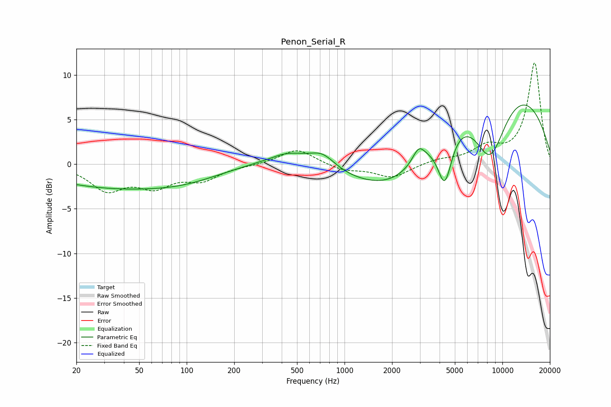

# Penon_Serial_R
See [usage instructions](https://github.com/jaakkopasanen/AutoEq#usage) for more options and info.

### Parametric EQs
Apply preamp of -6.7 dB when using parametric equalizer.

|   # | Type    |   Fc (Hz) |    Q |   Gain (dB) |
|-----|---------|-----------|------|-------------|
|   1 | Peaking |        37 | 0.3  |        -2.6 |
|   2 | Peaking |       100 | 0.68 |        -0.6 |
|   3 | Peaking |       340 | 1.55 |        -0.4 |
|   4 | Peaking |       420 | 0.92 |         1.9 |
|   5 | Peaking |       726 | 1.73 |         1.6 |
|   6 | Peaking |      2285 | 0.46 |        -8.3 |
|   7 | Peaking |      2952 | 3.61 |         1.7 |
|   8 | Peaking |      4316 | 3.06 |        -5.7 |
|   9 | Peaking |      7260 | 0.27 |        14.3 |
|  10 | Peaking |      8327 | 1.02 |       -10.7 |

### Fixed Band EQs
When using fixed band (also called graphic) equalizer, apply preamp of **-11.4 dB** (if available) and set gains manually with these parameters.

|   # | Type    |   Fc (Hz) |    Q |   Gain (dB) |
|-----|---------|-----------|------|-------------|
|   1 | Peaking |        31 | 1.41 |        -2.7 |
|   2 | Peaking |        62 | 1.41 |        -2.2 |
|   3 | Peaking |       125 | 1.41 |        -1.6 |
|   4 | Peaking |       250 | 1.41 |        -0.1 |
|   5 | Peaking |       500 | 1.41 |         1.8 |
|   6 | Peaking |      1000 | 1.41 |        -0.7 |
|   7 | Peaking |      2000 | 1.41 |        -1.5 |
|   8 | Peaking |      4000 | 1.41 |         0.5 |
|   9 | Peaking |      8000 | 1.41 |         1.7 |
|  10 | Peaking |     16000 | 1.41 |        11.3 |

### Graphs

