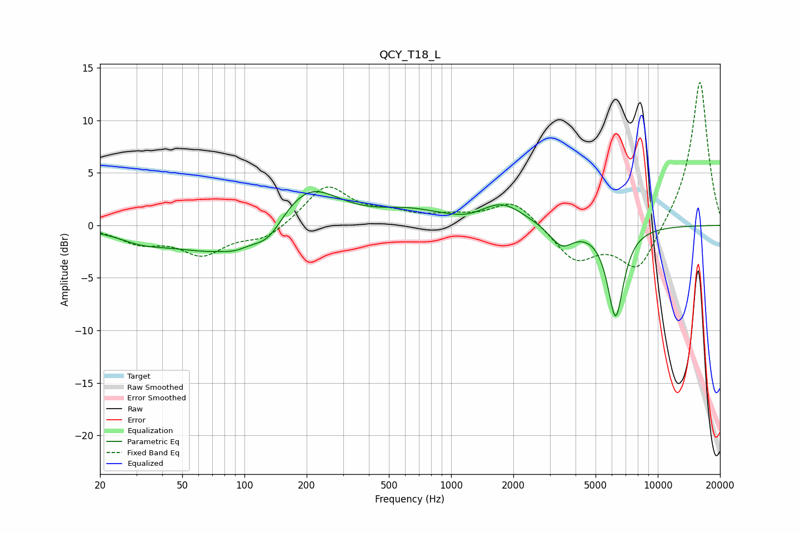

# QCY_T18_L
See [usage instructions](https://github.com/jaakkopasanen/AutoEq#usage) for more options and info.

### Parametric EQs
Apply preamp of -3.3 dB when using parametric equalizer.

|   # | Type    |   Fc (Hz) |    Q |   Gain (dB) |
|-----|---------|-----------|------|-------------|
|   1 | Peaking |        32 | 1.26 |        -0.8 |
|   2 | Peaking |        72 | 0.62 |        -2.6 |
|   3 | Peaking |        91 | 2.28 |        -0.5 |
|   4 | Peaking |       130 | 1.94 |        -1.8 |
|   5 | Peaking |       202 | 0.95 |         4.2 |
|   6 | Peaking |       630 | 0.91 |         1.1 |
|   7 | Peaking |      1199 | 1.93 |        -0.3 |
|   8 | Peaking |      1766 | 1.34 |         2   |
|   9 | Peaking |      3418 | 2.44 |        -2   |
|  10 | Peaking |      6248 | 3.47 |        -8.6 |

### Fixed Band EQs
When using fixed band (also called graphic) equalizer, apply preamp of **-13.7 dB** (if available) and set gains manually with these parameters.

|   # | Type    |   Fc (Hz) |    Q |   Gain (dB) |
|-----|---------|-----------|------|-------------|
|   1 | Peaking |        31 | 1.41 |        -1.5 |
|   2 | Peaking |        62 | 1.41 |        -2.6 |
|   3 | Peaking |       125 | 1.41 |        -1.3 |
|   4 | Peaking |       250 | 1.41 |         3.8 |
|   5 | Peaking |       500 | 1.41 |         0.9 |
|   6 | Peaking |      1000 | 1.41 |         0.7 |
|   7 | Peaking |      2000 | 1.41 |         2.4 |
|   8 | Peaking |      4000 | 1.41 |        -3.3 |
|   9 | Peaking |      8000 | 1.41 |        -4.4 |
|  10 | Peaking |     16000 | 1.41 |        14   |

### Graphs

