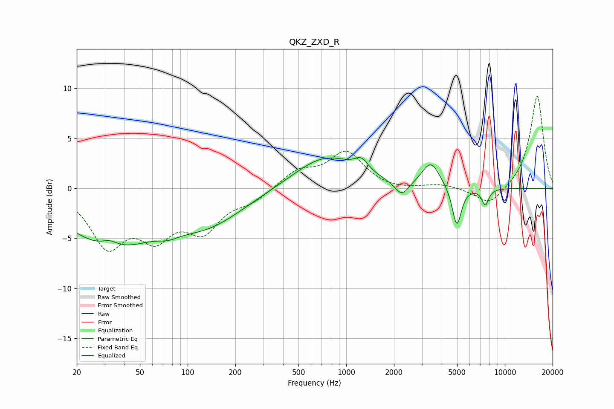

# QKZ_ZXD_R
See [usage instructions](https://github.com/jaakkopasanen/AutoEq#usage) for more options and info.

### Parametric EQs
Apply preamp of -3.2 dB when using parametric equalizer.

|   # | Type    |   Fc (Hz) |    Q |   Gain (dB) |
|-----|---------|-----------|------|-------------|
|   1 | Peaking |        32 | 0.51 |        -5.5 |
|   2 | Peaking |        32 | 2.64 |         0.8 |
|   3 | Peaking |        75 | 2.24 |        -0.5 |
|   4 | Peaking |       135 | 0.6  |        -3.1 |
|   5 | Peaking |       744 | 0.72 |         3.2 |
|   6 | Peaking |      1247 | 3.33 |         1.2 |
|   7 | Peaking |      2238 | 3.18 |        -1.5 |
|   8 | Peaking |      3417 | 2.52 |         2.5 |
|   9 | Peaking |      4979 | 4.85 |        -4   |
|  10 | Peaking |      7524 | 6    |        -1.6 |

### Fixed Band EQs
When using fixed band (also called graphic) equalizer, apply preamp of **-9.3 dB** (if available) and set gains manually with these parameters.

|   # | Type    |   Fc (Hz) |    Q |   Gain (dB) |
|-----|---------|-----------|------|-------------|
|   1 | Peaking |        31 | 1.41 |        -5.4 |
|   2 | Peaking |        62 | 1.41 |        -4.1 |
|   3 | Peaking |       125 | 1.41 |        -3.8 |
|   4 | Peaking |       250 | 1.41 |        -1.1 |
|   5 | Peaking |       500 | 1.41 |         1.7 |
|   6 | Peaking |      1000 | 1.41 |         3.5 |
|   7 | Peaking |      2000 | 1.41 |        -0.3 |
|   8 | Peaking |      4000 | 1.41 |         0.4 |
|   9 | Peaking |      8000 | 1.41 |        -1.8 |
|  10 | Peaking |     16000 | 1.41 |         9.3 |

### Graphs

