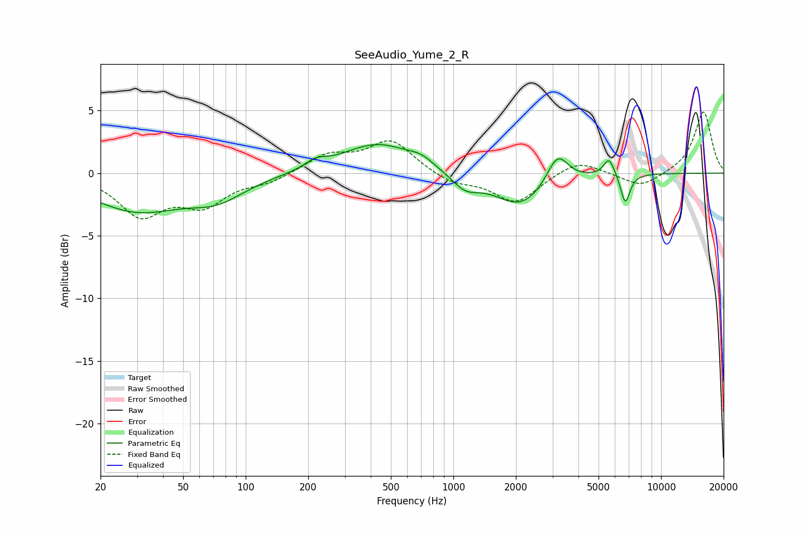

# SeeAudio_Yume_2_R
See [usage instructions](https://github.com/jaakkopasanen/AutoEq#usage) for more options and info.

### Parametric EQs
Apply preamp of -2.4 dB when using parametric equalizer.

|   # | Type    |   Fc (Hz) |    Q |   Gain (dB) |
|-----|---------|-----------|------|-------------|
|   1 | Peaking |        30 | 0.63 |        -2.9 |
|   2 | Peaking |        73 | 1.05 |        -1.6 |
|   3 | Peaking |       217 | 2.85 |         0.6 |
|   4 | Peaking |       431 | 0.82 |         2.4 |
|   5 | Peaking |       701 | 2.37 |         0.6 |
|   6 | Peaking |      1141 | 2.07 |        -1.2 |
|   7 | Peaking |      2108 | 1.12 |        -2.7 |
|   8 | Peaking |      3169 | 2.72 |         2.5 |
|   9 | Peaking |      5618 | 5.26 |         1.4 |
|  10 | Peaking |      6727 | 6    |        -2.4 |

### Fixed Band EQs
When using fixed band (also called graphic) equalizer, apply preamp of **-5.0 dB** (if available) and set gains manually with these parameters.

|   # | Type    |   Fc (Hz) |    Q |   Gain (dB) |
|-----|---------|-----------|------|-------------|
|   1 | Peaking |        31 | 1.41 |        -3.2 |
|   2 | Peaking |        62 | 1.41 |        -2.3 |
|   3 | Peaking |       125 | 1.41 |        -0.7 |
|   4 | Peaking |       250 | 1.41 |         1.4 |
|   5 | Peaking |       500 | 1.41 |         2.6 |
|   6 | Peaking |      1000 | 1.41 |        -0.8 |
|   7 | Peaking |      2000 | 1.41 |        -2.4 |
|   8 | Peaking |      4000 | 1.41 |         1.1 |
|   9 | Peaking |      8000 | 1.41 |        -1.2 |
|  10 | Peaking |     16000 | 1.41 |         4.9 |

### Graphs

