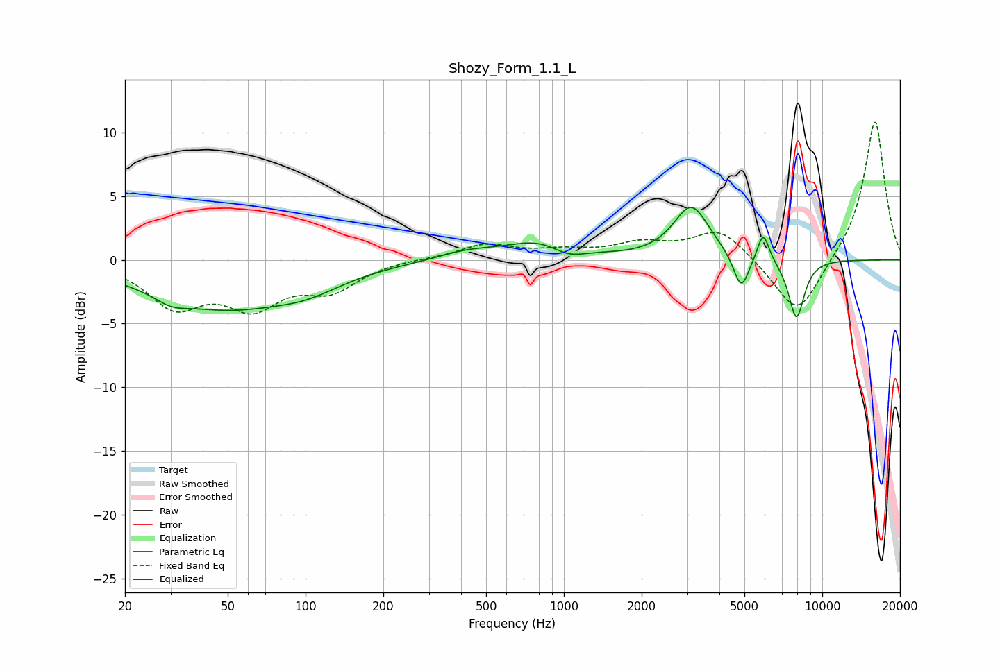

# Shozy_Form_1.1_L
See [usage instructions](https://github.com/jaakkopasanen/AutoEq#usage) for more options and info.

### Parametric EQs
Apply preamp of -4.2 dB when using parametric equalizer.

|   # | Type    |   Fc (Hz) |    Q |   Gain (dB) |
|-----|---------|-----------|------|-------------|
|   1 | Peaking |        30 | 2.5  |        -0.6 |
|   2 | Peaking |        48 | 0.5  |        -3.7 |
|   3 | Peaking |       102 | 1.08 |        -0.9 |
|   4 | Peaking |       418 | 1.29 |         0.6 |
|   5 | Peaking |       821 | 1.04 |         1.5 |
|   6 | Peaking |      1035 | 2.08 |        -0.9 |
|   7 | Peaking |      3116 | 2.05 |         4.2 |
|   8 | Peaking |      4857 | 4.65 |        -2.8 |
|   9 | Peaking |      5913 | 6    |         2.4 |
|  10 | Peaking |      7946 | 4.27 |        -4.7 |

### Fixed Band EQs
When using fixed band (also called graphic) equalizer, apply preamp of **-10.9 dB** (if available) and set gains manually with these parameters.

|   # | Type    |   Fc (Hz) |    Q |   Gain (dB) |
|-----|---------|-----------|------|-------------|
|   1 | Peaking |        31 | 1.41 |        -3.4 |
|   2 | Peaking |        62 | 1.41 |        -3.2 |
|   3 | Peaking |       125 | 1.41 |        -2.1 |
|   4 | Peaking |       250 | 1.41 |         0.1 |
|   5 | Peaking |       500 | 1.41 |         1.2 |
|   6 | Peaking |      1000 | 1.41 |         0.6 |
|   7 | Peaking |      2000 | 1.41 |         1.1 |
|   8 | Peaking |      4000 | 1.41 |         2.4 |
|   9 | Peaking |      8000 | 1.41 |        -4.6 |
|  10 | Peaking |     16000 | 1.41 |        11.1 |

### Graphs

