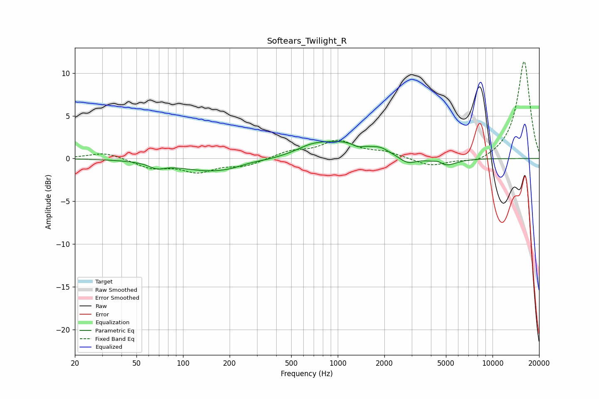

# Softears_Twilight_R
See [usage instructions](https://github.com/jaakkopasanen/AutoEq#usage) for more options and info.

### Parametric EQs
Apply preamp of -2.1 dB when using parametric equalizer.

|   # | Type    |   Fc (Hz) |    Q |   Gain (dB) |
|-----|---------|-----------|------|-------------|
|   1 | Peaking |        68 | 2.83 |        -0.6 |
|   2 | Peaking |       166 | 0.6  |        -1.6 |
|   3 | Peaking |       272 | 1.59 |         0.3 |
|   4 | Peaking |       671 | 1.64 |         0.5 |
|   5 | Peaking |      1060 | 0.67 |         2   |
|   6 | Peaking |      1347 | 4.2  |        -0.4 |
|   7 | Peaking |      1899 | 3.24 |         0.4 |
|   8 | Peaking |      2824 | 2.49 |        -0.9 |
|   9 | Peaking |      4473 | 4.61 |         0.4 |
|  10 | Peaking |      4911 | 1.98 |        -1   |

### Fixed Band EQs
When using fixed band (also called graphic) equalizer, apply preamp of **-11.4 dB** (if available) and set gains manually with these parameters.

|   # | Type    |   Fc (Hz) |    Q |   Gain (dB) |
|-----|---------|-----------|------|-------------|
|   1 | Peaking |        31 | 1.41 |         0.8 |
|   2 | Peaking |        62 | 1.41 |        -1   |
|   3 | Peaking |       125 | 1.41 |        -1.4 |
|   4 | Peaking |       250 | 1.41 |        -0.8 |
|   5 | Peaking |       500 | 1.41 |         0.8 |
|   6 | Peaking |      1000 | 1.41 |         1.9 |
|   7 | Peaking |      2000 | 1.41 |         0.7 |
|   8 | Peaking |      4000 | 1.41 |        -0.9 |
|   9 | Peaking |      8000 | 1.41 |        -0.7 |
|  10 | Peaking |     16000 | 1.41 |        11.4 |

### Graphs

