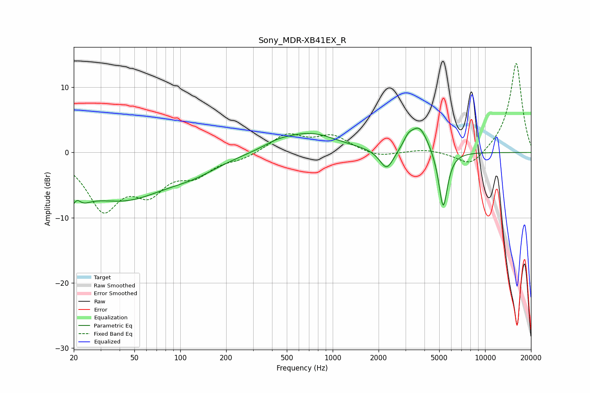

# Sony_MDR-XB41EX_R
See [usage instructions](https://github.com/jaakkopasanen/AutoEq#usage) for more options and info.

### Parametric EQs
Apply preamp of -3.8 dB when using parametric equalizer.

|   # | Type    |   Fc (Hz) |    Q |   Gain (dB) |
|-----|---------|-----------|------|-------------|
|   1 | Peaking |        20 | 2.42 |        -7.4 |
|   2 | Peaking |        21 | 4.34 |         4.2 |
|   3 | Peaking |        42 | 0.47 |        -6.8 |
|   4 | Peaking |       125 | 0.86 |        -1.5 |
|   5 | Peaking |       432 | 1.57 |         0.7 |
|   6 | Peaking |       706 | 0.77 |         2.9 |
|   7 | Peaking |      2263 | 3.07 |        -3.2 |
|   8 | Peaking |      3123 | 4.78 |         1.2 |
|   9 | Peaking |      3696 | 2.34 |         4.2 |
|  10 | Peaking |      5306 | 4.73 |        -9.1 |

### Fixed Band EQs
When using fixed band (also called graphic) equalizer, apply preamp of **-13.8 dB** (if available) and set gains manually with these parameters.

|   # | Type    |   Fc (Hz) |    Q |   Gain (dB) |
|-----|---------|-----------|------|-------------|
|   1 | Peaking |        31 | 1.41 |        -8.2 |
|   2 | Peaking |        62 | 1.41 |        -5.1 |
|   3 | Peaking |       125 | 1.41 |        -2.9 |
|   4 | Peaking |       250 | 1.41 |        -0.9 |
|   5 | Peaking |       500 | 1.41 |         2.7 |
|   6 | Peaking |      1000 | 1.41 |         2.4 |
|   7 | Peaking |      2000 | 1.41 |        -0.8 |
|   8 | Peaking |      4000 | 1.41 |         0.5 |
|   9 | Peaking |      8000 | 1.41 |        -2.4 |
|  10 | Peaking |     16000 | 1.41 |        13.9 |

### Graphs

