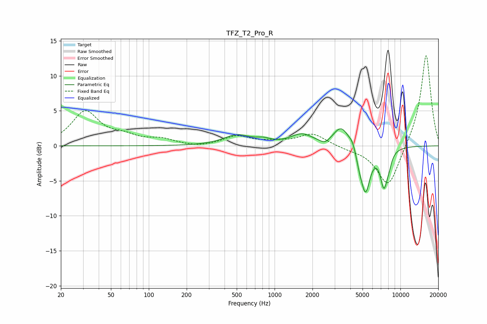

# TFZ_T2_Pro_R
See [usage instructions](https://github.com/jaakkopasanen/AutoEq#usage) for more options and info.

### Parametric EQs
Apply preamp of -2.5 dB when using parametric equalizer.

|   # | Type    |   Fc (Hz) |    Q |   Gain (dB) |
|-----|---------|-----------|------|-------------|
|   1 | Peaking |       502 | 1.32 |         1.5 |
|   2 | Peaking |       813 | 2.58 |         0.5 |
|   3 | Peaking |      1642 | 1.62 |         1.5 |
|   4 | Peaking |      2514 | 3.59 |        -0.7 |
|   5 | Peaking |      3394 | 2.21 |         2.9 |
|   6 | Peaking |      4151 | 6    |         0.8 |
|   7 | Peaking |      4707 | 6    |        -1.1 |
|   8 | Peaking |      5272 | 3.69 |        -6.5 |
|   9 | Peaking |      7394 | 4.54 |        -5.1 |
|  10 | Peaking |      8096 | 6    |        -1.1 |

### Fixed Band EQs
When using fixed band (also called graphic) equalizer, apply preamp of **-13.0 dB** (if available) and set gains manually with these parameters.

|   # | Type    |   Fc (Hz) |    Q |   Gain (dB) |
|-----|---------|-----------|------|-------------|
|   1 | Peaking |        31 | 1.41 |         4.8 |
|   2 | Peaking |        62 | 1.41 |         1.1 |
|   3 | Peaking |       125 | 1.41 |         0.8 |
|   4 | Peaking |       250 | 1.41 |        -0.3 |
|   5 | Peaking |       500 | 1.41 |         1.3 |
|   6 | Peaking |      1000 | 1.41 |         0.4 |
|   7 | Peaking |      2000 | 1.41 |         1.7 |
|   8 | Peaking |      4000 | 1.41 |        -0.4 |
|   9 | Peaking |      8000 | 1.41 |        -6.1 |
|  10 | Peaking |     16000 | 1.41 |        13.3 |

### Graphs

