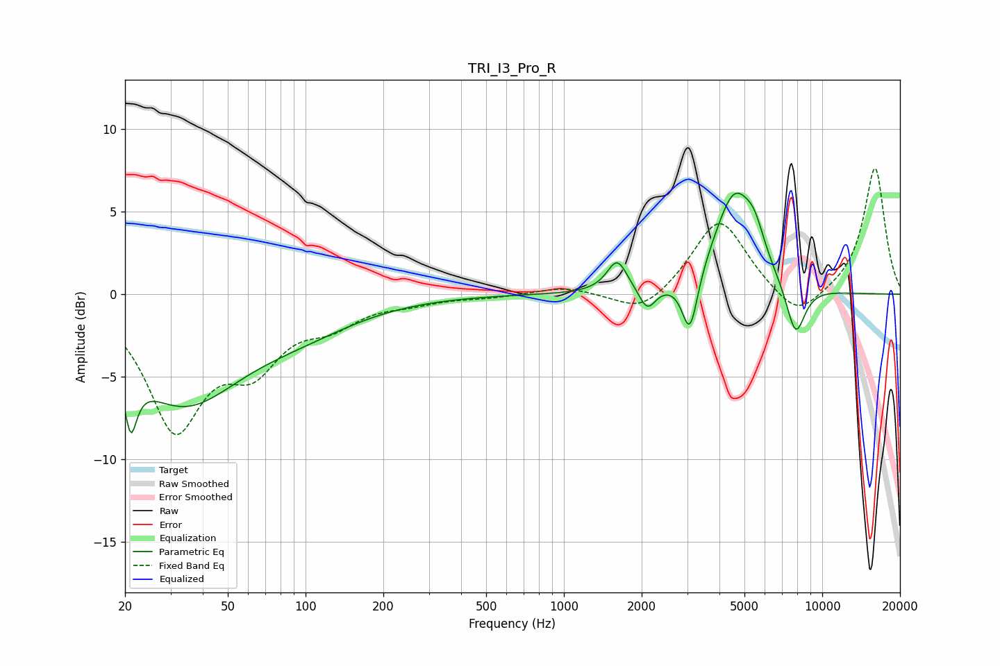

# TRI_I3_Pro_R
See [usage instructions](https://github.com/jaakkopasanen/AutoEq#usage) for more options and info.

### Parametric EQs
Apply preamp of -6.2 dB when using parametric equalizer.

|   # | Type    |   Fc (Hz) |    Q |   Gain (dB) |
|-----|---------|-----------|------|-------------|
|   1 | Peaking |        21 | 5.86 |        -6.9 |
|   2 | Peaking |        21 | 5.98 |         3.2 |
|   3 | Peaking |        33 | 0.63 |        -6.2 |
|   4 | Peaking |        97 | 0.62 |        -1.5 |
|   5 | Peaking |      1608 | 3.64 |         1.9 |
|   6 | Peaking |      2103 | 4.4  |        -1.4 |
|   7 | Peaking |      3075 | 4.66 |        -3.6 |
|   8 | Peaking |      4572 | 1.75 |         6   |
|   9 | Peaking |      5482 | 3.64 |         1.5 |
|  10 | Peaking |      7885 | 3.54 |        -3.2 |

### Fixed Band EQs
When using fixed band (also called graphic) equalizer, apply preamp of **-7.7 dB** (if available) and set gains manually with these parameters.

|   # | Type    |   Fc (Hz) |    Q |   Gain (dB) |
|-----|---------|-----------|------|-------------|
|   1 | Peaking |        31 | 1.41 |        -7.8 |
|   2 | Peaking |        62 | 1.41 |        -3.6 |
|   3 | Peaking |       125 | 1.41 |        -1.5 |
|   4 | Peaking |       250 | 1.41 |        -0.4 |
|   5 | Peaking |       500 | 1.41 |        -0.2 |
|   6 | Peaking |      1000 | 1.41 |         0.5 |
|   7 | Peaking |      2000 | 1.41 |        -1.4 |
|   8 | Peaking |      4000 | 1.41 |         4.7 |
|   9 | Peaking |      8000 | 1.41 |        -1.7 |
|  10 | Peaking |     16000 | 1.41 |         7.7 |

### Graphs

