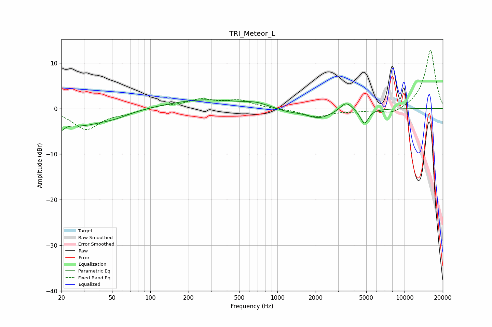

# TRI_Meteor_L
See [usage instructions](https://github.com/jaakkopasanen/AutoEq#usage) for more options and info.

### Parametric EQs
Apply preamp of -2.0 dB when using parametric equalizer.

|   # | Type    |   Fc (Hz) |    Q |   Gain (dB) |
|-----|---------|-----------|------|-------------|
|   1 | Peaking |        20 | 5.97 |        -4.4 |
|   2 | Peaking |        20 | 6    |         2.6 |
|   3 | Peaking |        27 | 0.74 |        -3.5 |
|   4 | Peaking |        53 | 1.18 |        -1   |
|   5 | Peaking |       266 | 0.49 |         2   |
|   6 | Peaking |       677 | 1.64 |         0.7 |
|   7 | Peaking |      1206 | 1.58 |        -0.6 |
|   8 | Peaking |      2131 | 1.36 |        -2.1 |
|   9 | Peaking |      3466 | 3.06 |         2   |
|  10 | Peaking |      4836 | 4.35 |        -3.3 |

### Fixed Band EQs
When using fixed band (also called graphic) equalizer, apply preamp of **-12.8 dB** (if available) and set gains manually with these parameters.

|   # | Type    |   Fc (Hz) |    Q |   Gain (dB) |
|-----|---------|-----------|------|-------------|
|   1 | Peaking |        31 | 1.41 |        -4.5 |
|   2 | Peaking |        62 | 1.41 |        -0.8 |
|   3 | Peaking |       125 | 1.41 |         0.6 |
|   4 | Peaking |       250 | 1.41 |         1.8 |
|   5 | Peaking |       500 | 1.41 |         1.6 |
|   6 | Peaking |      1000 | 1.41 |        -0.1 |
|   7 | Peaking |      2000 | 1.41 |        -1.8 |
|   8 | Peaking |      4000 | 1.41 |        -0.5 |
|   9 | Peaking |      8000 | 1.41 |        -1.4 |
|  10 | Peaking |     16000 | 1.41 |        12.9 |

### Graphs

