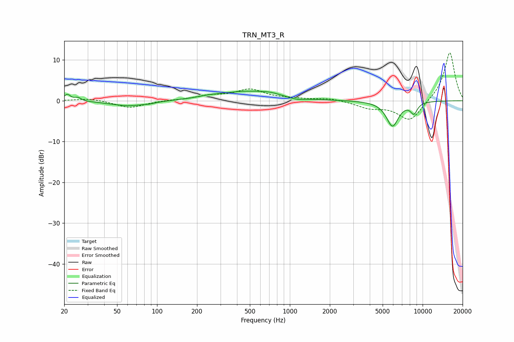

# TRN_MT3_R
See [usage instructions](https://github.com/jaakkopasanen/AutoEq#usage) for more options and info.

### Parametric EQs
Apply preamp of -2.5 dB when using parametric equalizer.

|   # | Type    |   Fc (Hz) |    Q |   Gain (dB) |
|-----|---------|-----------|------|-------------|
|   1 | Peaking |        21 | 5.96 |         1.6 |
|   2 | Peaking |        25 | 5.99 |         0.8 |
|   3 | Peaking |        61 | 1.05 |        -1.3 |
|   4 | Peaking |        87 | 3.64 |        -0.2 |
|   5 | Peaking |       244 | 1.81 |         0.3 |
|   6 | Peaking |       491 | 0.63 |         2.3 |
|   7 | Peaking |       716 | 2.48 |         0.3 |
|   8 | Peaking |      1126 | 2.36 |        -0.6 |
|   9 | Peaking |      5929 | 2.95 |        -6.1 |
|  10 | Peaking |      8596 | 4.88 |        -2.6 |

### Fixed Band EQs
When using fixed band (also called graphic) equalizer, apply preamp of **-11.8 dB** (if available) and set gains manually with these parameters.

|   # | Type    |   Fc (Hz) |    Q |   Gain (dB) |
|-----|---------|-----------|------|-------------|
|   1 | Peaking |        31 | 1.41 |         0.6 |
|   2 | Peaking |        62 | 1.41 |        -1.8 |
|   3 | Peaking |       125 | 1.41 |         0.1 |
|   4 | Peaking |       250 | 1.41 |         1.1 |
|   5 | Peaking |       500 | 1.41 |         2.6 |
|   6 | Peaking |      1000 | 1.41 |         0.4 |
|   7 | Peaking |      2000 | 1.41 |         0.6 |
|   8 | Peaking |      4000 | 1.41 |        -1.6 |
|   9 | Peaking |      8000 | 1.41 |        -5.1 |
|  10 | Peaking |     16000 | 1.41 |        12.1 |

### Graphs

