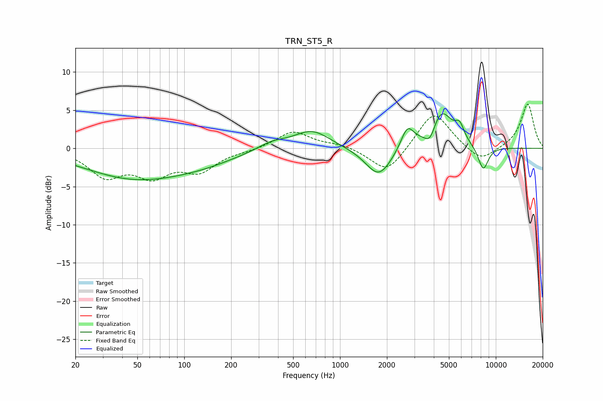

# TRN_ST5_R
See [usage instructions](https://github.com/jaakkopasanen/AutoEq#usage) for more options and info.

### Parametric EQs
Apply preamp of -4.6 dB when using parametric equalizer.

|   # | Type    |   Fc (Hz) |    Q |   Gain (dB) |
|-----|---------|-----------|------|-------------|
|   1 | Peaking |        48 | 0.43 |        -3.8 |
|   2 | Peaking |       134 | 0.63 |        -1.1 |
|   3 | Peaking |       364 | 1.48 |         0.9 |
|   4 | Peaking |       660 | 1.21 |         2.4 |
|   5 | Peaking |      1774 | 1.67 |        -3.9 |
|   6 | Peaking |      2708 | 3.36 |         2.9 |
|   7 | Peaking |      3786 | 4.06 |        -2   |
|   8 | Peaking |      4456 | 1.92 |         5   |
|   9 | Peaking |      5864 | 4.77 |         1.8 |
|  10 | Peaking |      8305 | 3.93 |        -3.2 |

### Fixed Band EQs
When using fixed band (also called graphic) equalizer, apply preamp of **-5.9 dB** (if available) and set gains manually with these parameters.

|   # | Type    |   Fc (Hz) |    Q |   Gain (dB) |
|-----|---------|-----------|------|-------------|
|   1 | Peaking |        31 | 1.41 |        -3.4 |
|   2 | Peaking |        62 | 1.41 |        -3.2 |
|   3 | Peaking |       125 | 1.41 |        -2.7 |
|   4 | Peaking |       250 | 1.41 |        -0.2 |
|   5 | Peaking |       500 | 1.41 |         2.3 |
|   6 | Peaking |      1000 | 1.41 |         0.5 |
|   7 | Peaking |      2000 | 1.41 |        -3.4 |
|   8 | Peaking |      4000 | 1.41 |         5   |
|   9 | Peaking |      8000 | 1.41 |        -1.9 |
|  10 | Peaking |     16000 | 1.41 |         5.9 |

### Graphs

