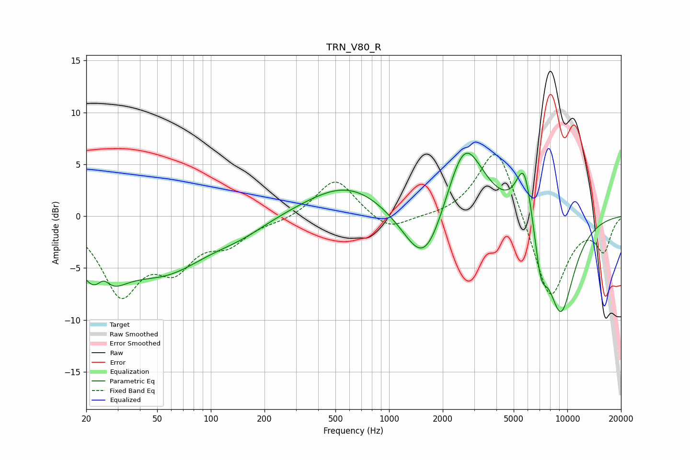

# TRN_V80_R
See [usage instructions](https://github.com/jaakkopasanen/AutoEq#usage) for more options and info.

### Parametric EQs
Apply preamp of -6.2 dB when using parametric equalizer.

|   # | Type    |   Fc (Hz) |    Q |   Gain (dB) |
|-----|---------|-----------|------|-------------|
|   1 | Peaking |        24 | 1.22 |        -6.1 |
|   2 | Peaking |        25 | 3.58 |         2   |
|   3 | Peaking |        56 | 0.59 |        -4.7 |
|   4 | Peaking |       147 | 0.95 |        -1   |
|   5 | Peaking |       590 | 0.61 |         3.2 |
|   6 | Peaking |      1586 | 1.18 |        -6.8 |
|   7 | Peaking |      2644 | 1.29 |         8.3 |
|   8 | Peaking |      5733 | 2.89 |         5.9 |
|   9 | Peaking |      7096 | 3.94 |        -3.9 |
|  10 | Peaking |      9176 | 1.56 |        -9.5 |

### Fixed Band EQs
When using fixed band (also called graphic) equalizer, apply preamp of **-6.0 dB** (if available) and set gains manually with these parameters.

|   # | Type    |   Fc (Hz) |    Q |   Gain (dB) |
|-----|---------|-----------|------|-------------|
|   1 | Peaking |        31 | 1.41 |        -7.1 |
|   2 | Peaking |        62 | 1.41 |        -4.1 |
|   3 | Peaking |       125 | 1.41 |        -2.2 |
|   4 | Peaking |       250 | 1.41 |        -0.4 |
|   5 | Peaking |       500 | 1.41 |         3.7 |
|   6 | Peaking |      1000 | 1.41 |        -1.6 |
|   7 | Peaking |      2000 | 1.41 |        -0.1 |
|   8 | Peaking |      4000 | 1.41 |         7.3 |
|   9 | Peaking |      8000 | 1.41 |        -8.4 |
|  10 | Peaking |     16000 | 1.41 |        -3.2 |

### Graphs

