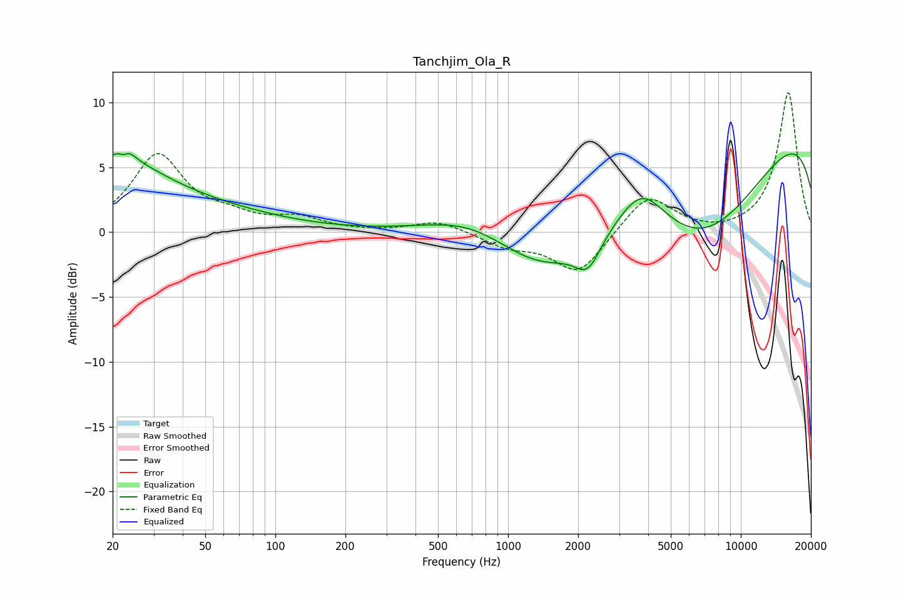

# Tanchjim_Ola_R
See [usage instructions](https://github.com/jaakkopasanen/AutoEq#usage) for more options and info.

### Parametric EQs
Apply preamp of -6.2 dB when using parametric equalizer.

|   # | Type    |   Fc (Hz) |    Q |   Gain (dB) |
|-----|---------|-----------|------|-------------|
|   1 | Peaking |        20 | 0.61 |         5.1 |
|   2 | Peaking |        22 | 5.78 |        -3.3 |
|   3 | Peaking |        22 | 4.87 |         3.9 |
|   4 | Peaking |        60 | 0.5  |         1   |
|   5 | Peaking |       693 | 0.74 |         1.6 |
|   6 | Peaking |      1446 | 0.66 |        -4.2 |
|   7 | Peaking |      2203 | 2.59 |        -2.3 |
|   8 | Peaking |      3758 | 1.4  |         3.2 |
|   9 | Peaking |      6843 | 0.41 |       -10.3 |
|  10 | Peaking |      9929 | 0.18 |        10.8 |

### Fixed Band EQs
When using fixed band (also called graphic) equalizer, apply preamp of **-10.8 dB** (if available) and set gains manually with these parameters.

|   # | Type    |   Fc (Hz) |    Q |   Gain (dB) |
|-----|---------|-----------|------|-------------|
|   1 | Peaking |        31 | 1.41 |         5.9 |
|   2 | Peaking |        62 | 1.41 |         0.9 |
|   3 | Peaking |       125 | 1.41 |         1   |
|   4 | Peaking |       250 | 1.41 |        -0   |
|   5 | Peaking |       500 | 1.41 |         0.9 |
|   6 | Peaking |      1000 | 1.41 |        -1   |
|   7 | Peaking |      2000 | 1.41 |        -3.2 |
|   8 | Peaking |      4000 | 1.41 |         3   |
|   9 | Peaking |      8000 | 1.41 |        -0.2 |
|  10 | Peaking |     16000 | 1.41 |        10.8 |

### Graphs

