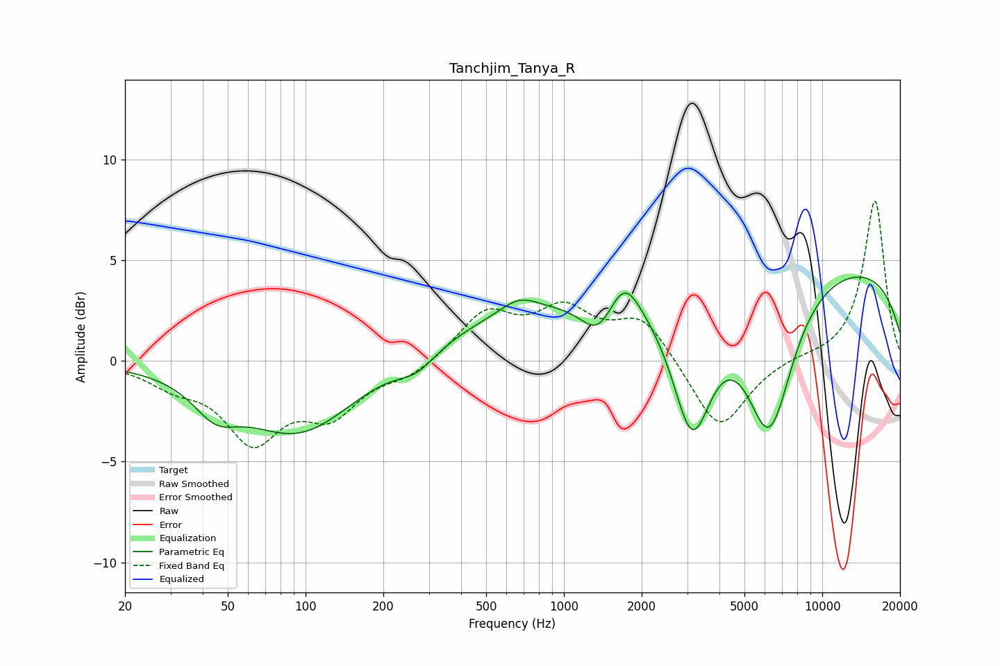

# Tanchjim_Tanya_R
See [usage instructions](https://github.com/jaakkopasanen/AutoEq#usage) for more options and info.

### Parametric EQs
Apply preamp of -4.3 dB when using parametric equalizer.

|   # | Type    |   Fc (Hz) |    Q |   Gain (dB) |
|-----|---------|-----------|------|-------------|
|   1 | Peaking |        45 | 1.68 |        -1.5 |
|   2 | Peaking |        94 | 0.65 |        -3.6 |
|   3 | Peaking |       269 | 1.85 |        -0.9 |
|   4 | Peaking |       670 | 1.96 |         0.8 |
|   5 | Peaking |       865 | 0.32 |         2.4 |
|   6 | Peaking |      1360 | 2.12 |        -1.8 |
|   7 | Peaking |      1711 | 2.31 |         1.9 |
|   8 | Peaking |      3136 | 1.83 |        -6.6 |
|   9 | Peaking |      6241 | 1.47 |        -7.5 |
|  10 | Peaking |      9943 | 0.21 |         4.9 |

### Fixed Band EQs
When using fixed band (also called graphic) equalizer, apply preamp of **-8.0 dB** (if available) and set gains manually with these parameters.

|   # | Type    |   Fc (Hz) |    Q |   Gain (dB) |
|-----|---------|-----------|------|-------------|
|   1 | Peaking |        31 | 1.41 |        -1   |
|   2 | Peaking |        62 | 1.41 |        -3.7 |
|   3 | Peaking |       125 | 1.41 |        -2.4 |
|   4 | Peaking |       250 | 1.41 |        -0.7 |
|   5 | Peaking |       500 | 1.41 |         2.3 |
|   6 | Peaking |      1000 | 1.41 |         2.3 |
|   7 | Peaking |      2000 | 1.41 |         2.1 |
|   8 | Peaking |      4000 | 1.41 |        -3.6 |
|   9 | Peaking |      8000 | 1.41 |         0.2 |
|  10 | Peaking |     16000 | 1.41 |         8   |

### Graphs

