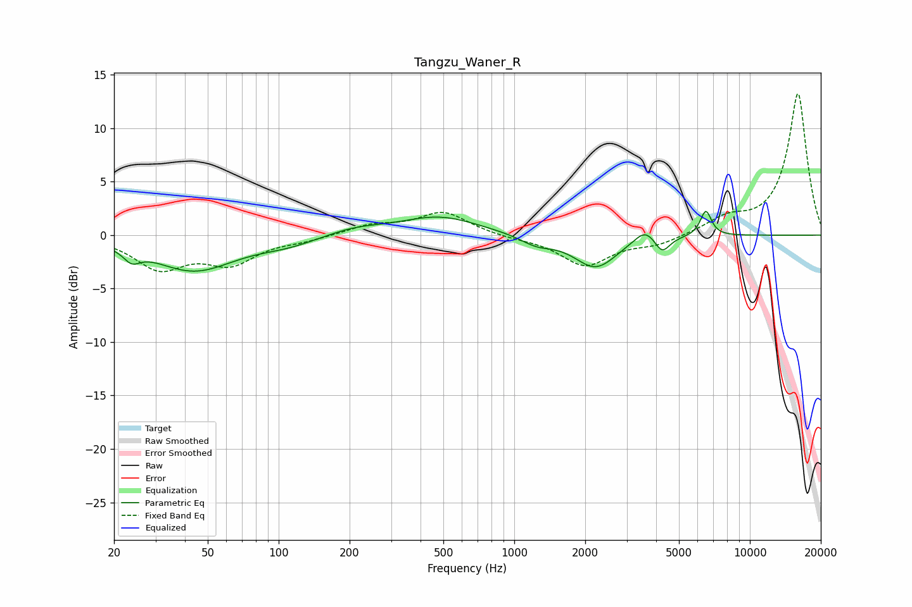

# Tangzu_Waner_R
See [usage instructions](https://github.com/jaakkopasanen/AutoEq#usage) for more options and info.

### Parametric EQs
Apply preamp of -2.3 dB when using parametric equalizer.

|   # | Type    |   Fc (Hz) |    Q |   Gain (dB) |
|-----|---------|-----------|------|-------------|
|   1 | Peaking |        24 | 4.07 |        -1.1 |
|   2 | Peaking |        44 | 0.81 |        -3.3 |
|   3 | Peaking |       109 | 1.15 |        -0.7 |
|   4 | Peaking |       211 | 1.19 |         0.6 |
|   5 | Peaking |       481 | 0.85 |         1.7 |
|   6 | Peaking |      1241 | 2.05 |        -0.8 |
|   7 | Peaking |      2215 | 1.54 |        -3   |
|   8 | Peaking |      3605 | 3.01 |         1.3 |
|   9 | Peaking |      4239 | 4.32 |        -1.6 |
|  10 | Peaking |      6503 | 5.82 |         2.4 |

### Fixed Band EQs
When using fixed band (also called graphic) equalizer, apply preamp of **-13.3 dB** (if available) and set gains manually with these parameters.

|   # | Type    |   Fc (Hz) |    Q |   Gain (dB) |
|-----|---------|-----------|------|-------------|
|   1 | Peaking |        31 | 1.41 |        -3   |
|   2 | Peaking |        62 | 1.41 |        -2.4 |
|   3 | Peaking |       125 | 1.41 |        -0.4 |
|   4 | Peaking |       250 | 1.41 |         0.9 |
|   5 | Peaking |       500 | 1.41 |         2.1 |
|   6 | Peaking |      1000 | 1.41 |        -0.2 |
|   7 | Peaking |      2000 | 1.41 |        -2.8 |
|   8 | Peaking |      4000 | 1.41 |        -0.8 |
|   9 | Peaking |      8000 | 1.41 |         1.3 |
|  10 | Peaking |     16000 | 1.41 |        13.3 |

### Graphs

