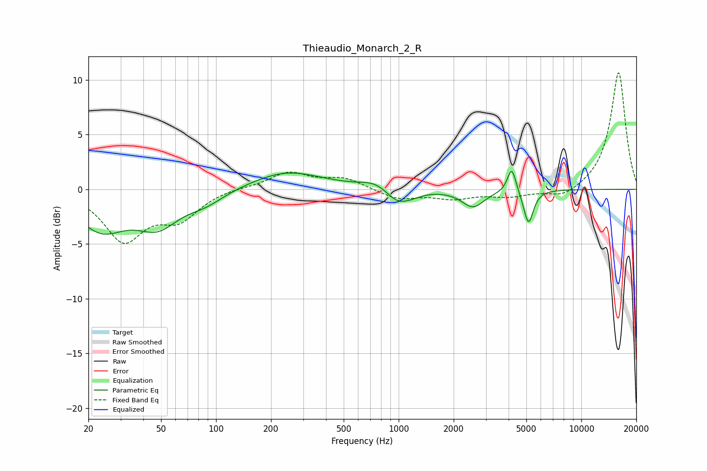

# Thieaudio_Monarch_2_R
See [usage instructions](https://github.com/jaakkopasanen/AutoEq#usage) for more options and info.

### Parametric EQs
Apply preamp of -1.7 dB when using parametric equalizer.

|   # | Type    |   Fc (Hz) |    Q |   Gain (dB) |
|-----|---------|-----------|------|-------------|
|   1 | Peaking |        24 | 1.07 |        -3.4 |
|   2 | Peaking |        48 | 1.22 |        -2.8 |
|   3 | Peaking |        87 | 1.34 |        -1   |
|   4 | Peaking |       244 | 0.73 |         1.7 |
|   5 | Peaking |       756 | 1.7  |         0.7 |
|   6 | Peaking |       969 | 2.19 |        -1.2 |
|   7 | Peaking |      1142 | 2.04 |        -0.5 |
|   8 | Peaking |      2551 | 2.32 |        -1.6 |
|   9 | Peaking |      4161 | 6    |         2.3 |
|  10 | Peaking |      5139 | 5.33 |        -3.1 |

### Fixed Band EQs
When using fixed band (also called graphic) equalizer, apply preamp of **-10.7 dB** (if available) and set gains manually with these parameters.

|   # | Type    |   Fc (Hz) |    Q |   Gain (dB) |
|-----|---------|-----------|------|-------------|
|   1 | Peaking |        31 | 1.41 |        -4.5 |
|   2 | Peaking |        62 | 1.41 |        -2.4 |
|   3 | Peaking |       125 | 1.41 |         0.2 |
|   4 | Peaking |       250 | 1.41 |         1.5 |
|   5 | Peaking |       500 | 1.41 |         1   |
|   6 | Peaking |      1000 | 1.41 |        -0.9 |
|   7 | Peaking |      2000 | 1.41 |        -0.8 |
|   8 | Peaking |      4000 | 1.41 |        -0.6 |
|   9 | Peaking |      8000 | 1.41 |        -0.9 |
|  10 | Peaking |     16000 | 1.41 |        10.8 |

### Graphs

