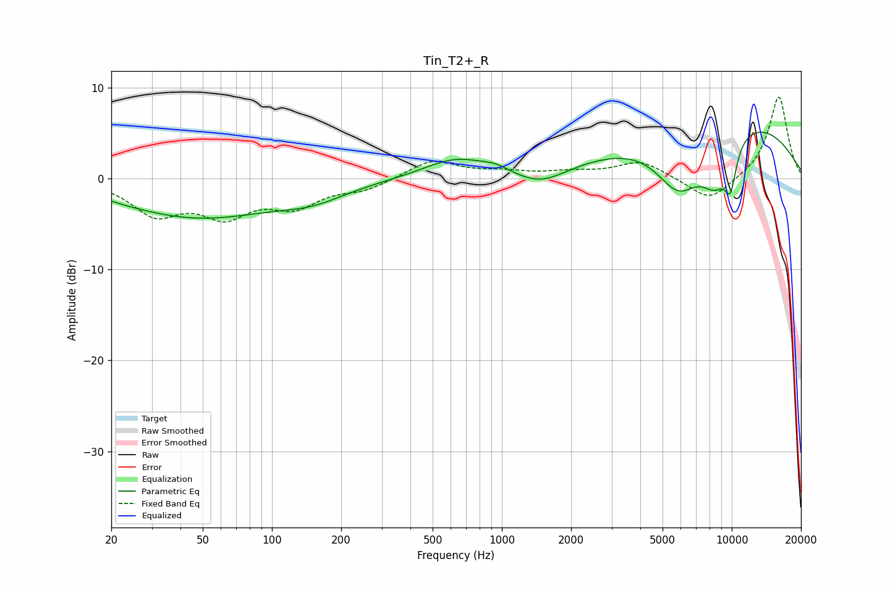

# Tin_T2+_R
See [usage instructions](https://github.com/jaakkopasanen/AutoEq#usage) for more options and info.

### Parametric EQs
Apply preamp of -5.2 dB when using parametric equalizer.

|   # | Type    |   Fc (Hz) |    Q |   Gain (dB) |
|-----|---------|-----------|------|-------------|
|   1 | Peaking |        20 | 5.97 |         0.1 |
|   2 | Peaking |        48 | 0.41 |        -4.2 |
|   3 | Peaking |       151 | 0.97 |        -1.4 |
|   4 | Peaking |       634 | 1    |         2.2 |
|   5 | Peaking |       938 | 2.64 |         0.5 |
|   6 | Peaking |      1476 | 1.29 |        -1.8 |
|   7 | Peaking |      5871 | 1.29 |        -6.6 |
|   8 | Peaking |      8485 | 1.9  |        -5   |
|   9 | Peaking |      8940 | 0.3  |         7.4 |
|  10 | Peaking |      9876 | 4.77 |        -4.2 |

### Fixed Band EQs
When using fixed band (also called graphic) equalizer, apply preamp of **-9.1 dB** (if available) and set gains manually with these parameters.

|   # | Type    |   Fc (Hz) |    Q |   Gain (dB) |
|-----|---------|-----------|------|-------------|
|   1 | Peaking |        31 | 1.41 |        -3.7 |
|   2 | Peaking |        62 | 1.41 |        -3.6 |
|   3 | Peaking |       125 | 1.41 |        -2.7 |
|   4 | Peaking |       250 | 1.41 |        -1.1 |
|   5 | Peaking |       500 | 1.41 |         2   |
|   6 | Peaking |      1000 | 1.41 |         0.6 |
|   7 | Peaking |      2000 | 1.41 |         0.6 |
|   8 | Peaking |      4000 | 1.41 |         1.9 |
|   9 | Peaking |      8000 | 1.41 |        -2.7 |
|  10 | Peaking |     16000 | 1.41 |         9.1 |

### Graphs

