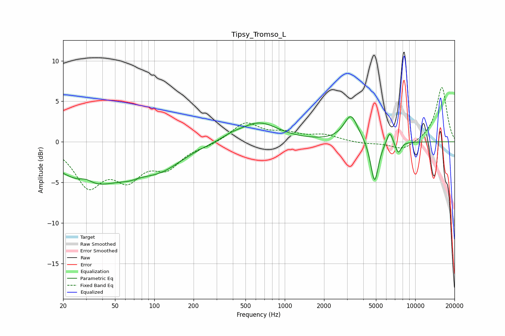

# Tipsy_Tromso_L
See [usage instructions](https://github.com/jaakkopasanen/AutoEq#usage) for more options and info.

### Parametric EQs
Apply preamp of -3.2 dB when using parametric equalizer.

|   # | Type    |   Fc (Hz) |    Q |   Gain (dB) |
|-----|---------|-----------|------|-------------|
|   1 | Peaking |        30 | 2.92 |         0.6 |
|   2 | Peaking |        33 | 0.53 |        -5   |
|   3 | Peaking |        64 | 2.14 |        -0.4 |
|   4 | Peaking |       112 | 0.8  |        -2.5 |
|   5 | Peaking |       390 | 1.89 |         0.4 |
|   6 | Peaking |       634 | 0.95 |         2.4 |
|   7 | Peaking |      3215 | 2.61 |         3.3 |
|   8 | Peaking |      4878 | 4.66 |        -5.3 |
|   9 | Peaking |      6377 | 5.97 |         1.6 |
|  10 | Peaking |      7415 | 6    |        -1.4 |

### Fixed Band EQs
When using fixed band (also called graphic) equalizer, apply preamp of **-6.8 dB** (if available) and set gains manually with these parameters.

|   # | Type    |   Fc (Hz) |    Q |   Gain (dB) |
|-----|---------|-----------|------|-------------|
|   1 | Peaking |        31 | 1.41 |        -5.1 |
|   2 | Peaking |        62 | 1.41 |        -3.8 |
|   3 | Peaking |       125 | 1.41 |        -2.8 |
|   4 | Peaking |       250 | 1.41 |        -0.4 |
|   5 | Peaking |       500 | 1.41 |         2.3 |
|   6 | Peaking |      1000 | 1.41 |         0.9 |
|   7 | Peaking |      2000 | 1.41 |         0.8 |
|   8 | Peaking |      4000 | 1.41 |        -0.2 |
|   9 | Peaking |      8000 | 1.41 |        -1.1 |
|  10 | Peaking |     16000 | 1.41 |         6.8 |

### Graphs

