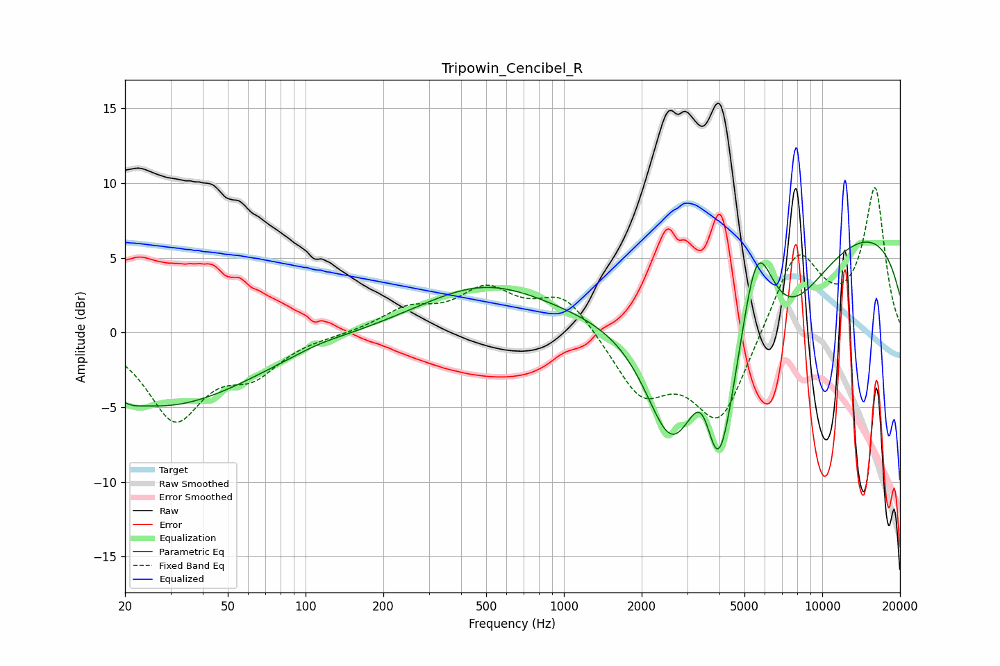

# Tripowin_Cencibel_R
See [usage instructions](https://github.com/jaakkopasanen/AutoEq#usage) for more options and info.

### Parametric EQs
Apply preamp of -6.1 dB when using parametric equalizer.

|   # | Type    |   Fc (Hz) |    Q |   Gain (dB) |
|-----|---------|-----------|------|-------------|
|   1 | Peaking |        21 | 5.18 |        -0.2 |
|   2 | Peaking |        27 | 0.4  |        -4.9 |
|   3 | Peaking |       113 | 1.51 |         0.2 |
|   4 | Peaking |       493 | 0.57 |         3.1 |
|   5 | Peaking |      2588 | 1.39 |        -7   |
|   6 | Peaking |      3490 | 2.21 |         6   |
|   7 | Peaking |      3931 | 1.49 |       -16.1 |
|   8 | Peaking |      5559 | 1.87 |         9.3 |
|   9 | Peaking |      6909 | 0.75 |        -5.6 |
|  10 | Peaking |     10000 | 0.19 |         7.9 |

### Fixed Band EQs
When using fixed band (also called graphic) equalizer, apply preamp of **-9.8 dB** (if available) and set gains manually with these parameters.

|   # | Type    |   Fc (Hz) |    Q |   Gain (dB) |
|-----|---------|-----------|------|-------------|
|   1 | Peaking |        31 | 1.41 |        -5.6 |
|   2 | Peaking |        62 | 1.41 |        -2.3 |
|   3 | Peaking |       125 | 1.41 |        -0.1 |
|   4 | Peaking |       250 | 1.41 |         1.4 |
|   5 | Peaking |       500 | 1.41 |         2.6 |
|   6 | Peaking |      1000 | 1.41 |         2.6 |
|   7 | Peaking |      2000 | 1.41 |        -4   |
|   8 | Peaking |      4000 | 1.41 |        -6   |
|   9 | Peaking |      8000 | 1.41 |         5.6 |
|  10 | Peaking |     16000 | 1.41 |         9.5 |

### Graphs

