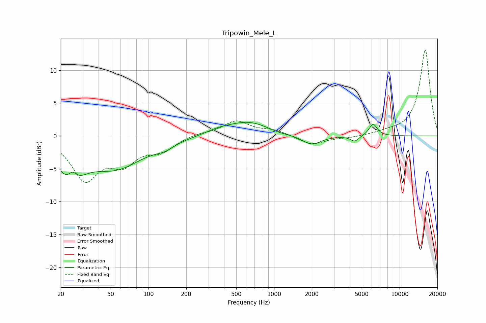

# Tripowin_Mele_L
See [usage instructions](https://github.com/jaakkopasanen/AutoEq#usage) for more options and info.

### Parametric EQs
Apply preamp of -2.2 dB when using parametric equalizer.

|   # | Type    |   Fc (Hz) |    Q |   Gain (dB) |
|-----|---------|-----------|------|-------------|
|   1 | Peaking |        24 | 1.47 |        -5.7 |
|   2 | Peaking |        25 | 3.9  |         2.2 |
|   3 | Peaking |        55 | 0.64 |        -4.6 |
|   4 | Peaking |       134 | 1.85 |        -0.8 |
|   5 | Peaking |       359 | 1.58 |         0.4 |
|   6 | Peaking |       626 | 0.78 |         2.2 |
|   7 | Peaking |      1091 | 1.45 |        -0.4 |
|   8 | Peaking |      1988 | 1.87 |        -1.5 |
|   9 | Peaking |      4390 | 4.24 |        -0.9 |
|  10 | Peaking |      6151 | 4.18 |         1.9 |

### Fixed Band EQs
When using fixed band (also called graphic) equalizer, apply preamp of **-13.2 dB** (if available) and set gains manually with these parameters.

|   # | Type    |   Fc (Hz) |    Q |   Gain (dB) |
|-----|---------|-----------|------|-------------|
|   1 | Peaking |        31 | 1.41 |        -6.4 |
|   2 | Peaking |        62 | 1.41 |        -3.5 |
|   3 | Peaking |       125 | 1.41 |        -2   |
|   4 | Peaking |       250 | 1.41 |         0.4 |
|   5 | Peaking |       500 | 1.41 |         2.2 |
|   6 | Peaking |      1000 | 1.41 |         0.8 |
|   7 | Peaking |      2000 | 1.41 |        -1.4 |
|   8 | Peaking |      4000 | 1.41 |        -0.3 |
|   9 | Peaking |      8000 | 1.41 |         0.4 |
|  10 | Peaking |     16000 | 1.41 |        13.2 |

### Graphs

