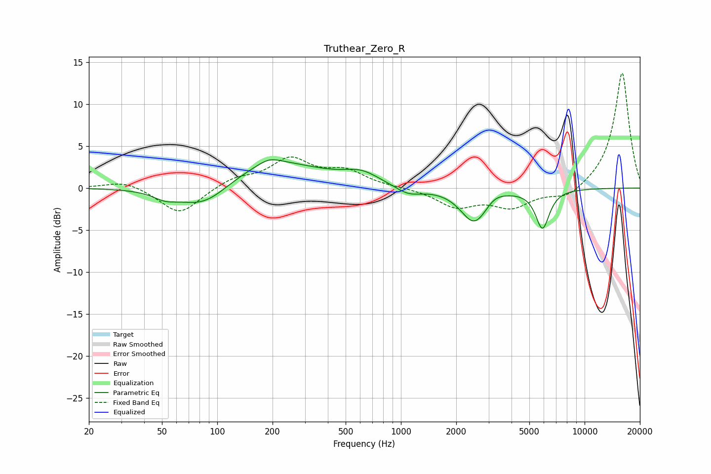

# Truthear_Zero_R
See [usage instructions](https://github.com/jaakkopasanen/AutoEq#usage) for more options and info.

### Parametric EQs
Apply preamp of -3.5 dB when using parametric equalizer.

|   # | Type    |   Fc (Hz) |    Q |   Gain (dB) |
|-----|---------|-----------|------|-------------|
|   1 | Peaking |        52 | 2.14 |        -0.8 |
|   2 | Peaking |        84 | 1    |        -3.1 |
|   3 | Peaking |       192 | 2.34 |         0.7 |
|   4 | Peaking |       196 | 0.52 |         3.3 |
|   5 | Peaking |       611 | 1.46 |         1.3 |
|   6 | Peaking |      1099 | 1.95 |        -1   |
|   7 | Peaking |      2483 | 1.96 |        -3.8 |
|   8 | Peaking |      2753 | 2.41 |        -0.5 |
|   9 | Peaking |      3200 | 2.54 |         0.8 |
|  10 | Peaking |      5897 | 3.71 |        -4.6 |

### Fixed Band EQs
When using fixed band (also called graphic) equalizer, apply preamp of **-13.8 dB** (if available) and set gains manually with these parameters.

|   # | Type    |   Fc (Hz) |    Q |   Gain (dB) |
|-----|---------|-----------|------|-------------|
|   1 | Peaking |        31 | 1.41 |         0.9 |
|   2 | Peaking |        62 | 1.41 |        -3.2 |
|   3 | Peaking |       125 | 1.41 |         1.1 |
|   4 | Peaking |       250 | 1.41 |         3.3 |
|   5 | Peaking |       500 | 1.41 |         1.8 |
|   6 | Peaking |      1000 | 1.41 |         0.1 |
|   7 | Peaking |      2000 | 1.41 |        -2.1 |
|   8 | Peaking |      4000 | 1.41 |        -2.1 |
|   9 | Peaking |      8000 | 1.41 |        -1.3 |
|  10 | Peaking |     16000 | 1.41 |        13.9 |

### Graphs

