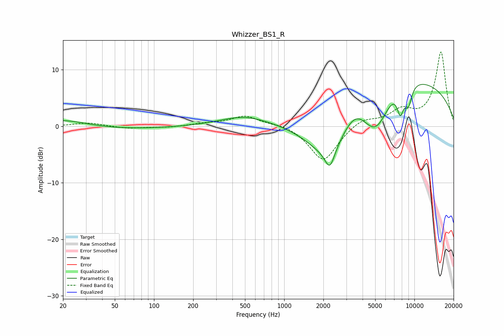

# Whizzer_BS1_R
See [usage instructions](https://github.com/jaakkopasanen/AutoEq#usage) for more options and info.

### Parametric EQs
Apply preamp of -7.5 dB when using parametric equalizer.

|   # | Type    |   Fc (Hz) |    Q |   Gain (dB) |
|-----|---------|-----------|------|-------------|
|   1 | Peaking |        20 | 0.74 |         1.5 |
|   2 | Peaking |        39 | 0.3  |        -0.6 |
|   3 | Peaking |       485 | 0.79 |         1.6 |
|   4 | Peaking |      2241 | 3.93 |        -3.4 |
|   5 | Peaking |      2252 | 0.75 |        -8.8 |
|   6 | Peaking |      3516 | 1.1  |         6.4 |
|   7 | Peaking |      5095 | 0.63 |       -18.7 |
|   8 | Peaking |      6707 | 0.34 |        20   |
|   9 | Peaking |      7800 | 5.25 |        -4.2 |
|  10 | Peaking |      8959 | 4.55 |        -3.7 |

### Fixed Band EQs
When using fixed band (also called graphic) equalizer, apply preamp of **-13.2 dB** (if available) and set gains manually with these parameters.

|   # | Type    |   Fc (Hz) |    Q |   Gain (dB) |
|-----|---------|-----------|------|-------------|
|   1 | Peaking |        31 | 1.41 |         0.6 |
|   2 | Peaking |        62 | 1.41 |        -0.4 |
|   3 | Peaking |       125 | 1.41 |        -0.2 |
|   4 | Peaking |       250 | 1.41 |         0.4 |
|   5 | Peaking |       500 | 1.41 |         1.8 |
|   6 | Peaking |      1000 | 1.41 |         0.5 |
|   7 | Peaking |      2000 | 1.41 |        -6.3 |
|   8 | Peaking |      4000 | 1.41 |         1.5 |
|   9 | Peaking |      8000 | 1.41 |         2.5 |
|  10 | Peaking |     16000 | 1.41 |        13.1 |

### Graphs

