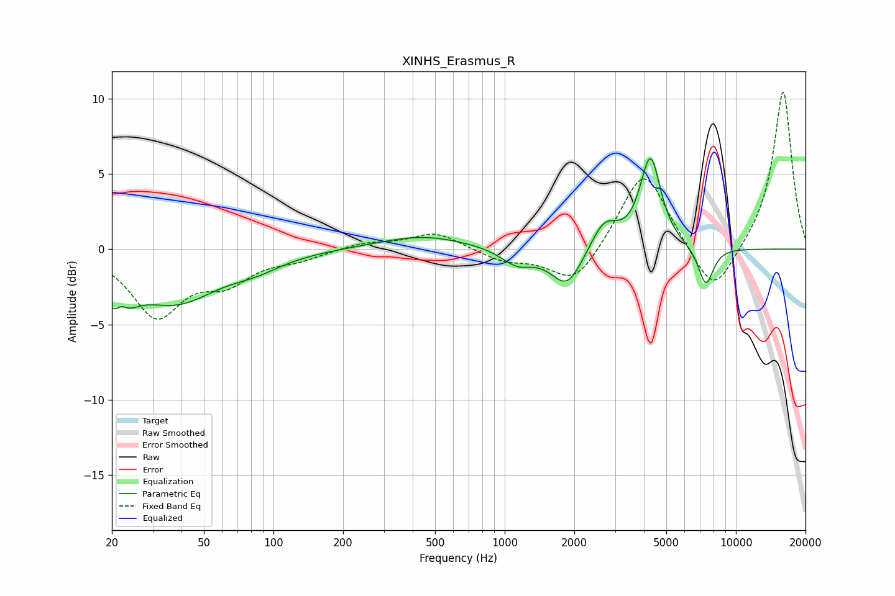

# XINHS_Erasmus_R
See [usage instructions](https://github.com/jaakkopasanen/AutoEq#usage) for more options and info.

### Parametric EQs
Apply preamp of -6.1 dB when using parametric equalizer.

|   # | Type    |   Fc (Hz) |    Q |   Gain (dB) |
|-----|---------|-----------|------|-------------|
|   1 | Peaking |        21 | 2.54 |        -3.7 |
|   2 | Peaking |        22 | 4.65 |         1.6 |
|   3 | Peaking |        38 | 0.78 |        -3.3 |
|   4 | Peaking |        84 | 1.21 |        -0.7 |
|   5 | Peaking |       443 | 0.74 |         0.9 |
|   6 | Peaking |      1133 | 2.07 |        -1.1 |
|   7 | Peaking |      1860 | 2.06 |        -2.6 |
|   8 | Peaking |      2693 | 2.42 |         1.9 |
|   9 | Peaking |      4269 | 3.13 |         6   |
|  10 | Peaking |      7411 | 4.07 |        -2.6 |

### Fixed Band EQs
When using fixed band (also called graphic) equalizer, apply preamp of **-10.5 dB** (if available) and set gains manually with these parameters.

|   # | Type    |   Fc (Hz) |    Q |   Gain (dB) |
|-----|---------|-----------|------|-------------|
|   1 | Peaking |        31 | 1.41 |        -4.3 |
|   2 | Peaking |        62 | 1.41 |        -1.9 |
|   3 | Peaking |       125 | 1.41 |        -0.6 |
|   4 | Peaking |       250 | 1.41 |         0.4 |
|   5 | Peaking |       500 | 1.41 |         1.1 |
|   6 | Peaking |      1000 | 1.41 |        -0.8 |
|   7 | Peaking |      2000 | 1.41 |        -2.5 |
|   8 | Peaking |      4000 | 1.41 |         5.5 |
|   9 | Peaking |      8000 | 1.41 |        -3.4 |
|  10 | Peaking |     16000 | 1.41 |        10.6 |

### Graphs

