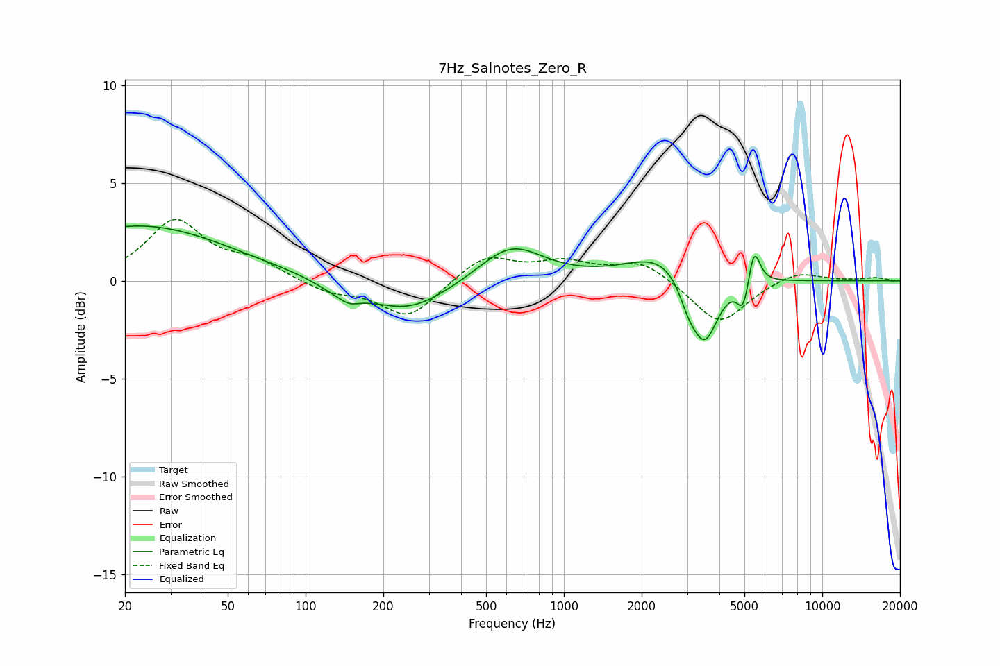

# 7Hz_Salnotes_Zero_R
See [usage instructions](https://github.com/jaakkopasanen/AutoEq#usage) for more options and info.

### Parametric EQs
Apply preamp of -2.9 dB when using parametric equalizer.

|   # | Type    |   Fc (Hz) |    Q |   Gain (dB) |
|-----|---------|-----------|------|-------------|
|   1 | Peaking |        23 | 0.41 |         2.8 |
|   2 | Peaking |       139 | 1.7  |        -0.6 |
|   3 | Peaking |       149 | 4.39 |        -0.2 |
|   4 | Peaking |       251 | 0.91 |        -1.6 |
|   5 | Peaking |       625 | 1.15 |         1.9 |
|   6 | Peaking |      2415 | 1.05 |         1.4 |
|   7 | Peaking |      3020 | 4.1  |        -1   |
|   8 | Peaking |      3500 | 2.66 |        -3.5 |
|   9 | Peaking |      4957 | 6    |        -1.6 |
|  10 | Peaking |      5437 | 6    |         2   |

### Fixed Band EQs
When using fixed band (also called graphic) equalizer, apply preamp of **-3.2 dB** (if available) and set gains manually with these parameters.

|   # | Type    |   Fc (Hz) |    Q |   Gain (dB) |
|-----|---------|-----------|------|-------------|
|   1 | Peaking |        31 | 1.41 |         3   |
|   2 | Peaking |        62 | 1.41 |         0.9 |
|   3 | Peaking |       125 | 1.41 |        -0.6 |
|   4 | Peaking |       250 | 1.41 |        -1.9 |
|   5 | Peaking |       500 | 1.41 |         1.3 |
|   6 | Peaking |      1000 | 1.41 |         0.8 |
|   7 | Peaking |      2000 | 1.41 |         1   |
|   8 | Peaking |      4000 | 1.41 |        -2.3 |
|   9 | Peaking |      8000 | 1.41 |         0.6 |
|  10 | Peaking |     16000 | 1.41 |         0.2 |

### Graphs

