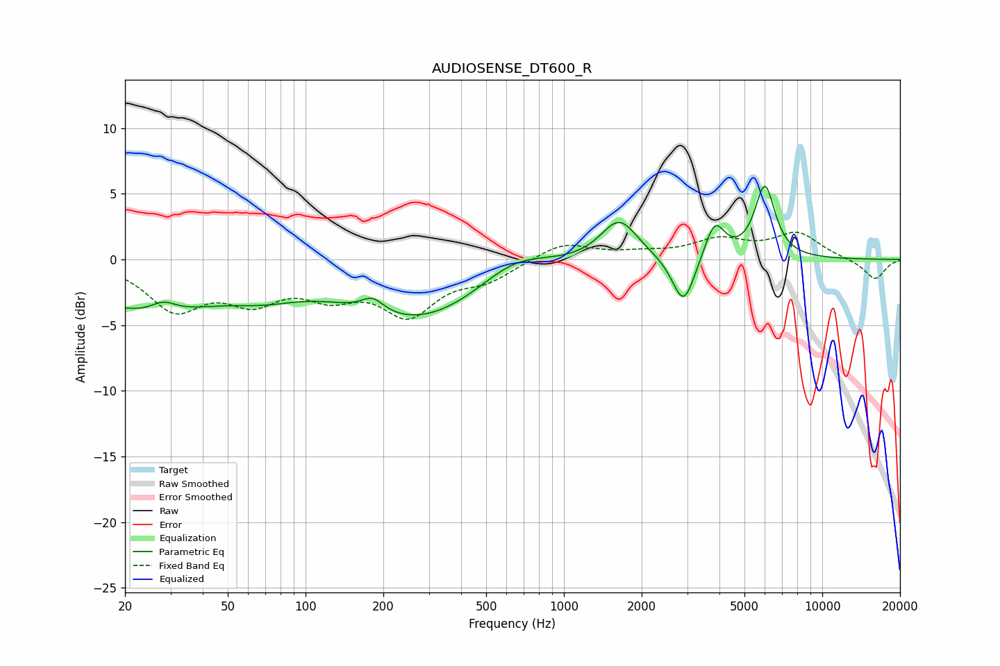

# AUDIOSENSE_DT600_R
See [usage instructions](https://github.com/jaakkopasanen/AutoEq#usage) for more options and info.

### Parametric EQs
Apply preamp of -5.7 dB when using parametric equalizer.

|   # | Type    |   Fc (Hz) |    Q |   Gain (dB) |
|-----|---------|-----------|------|-------------|
|   1 | Peaking |        24 | 0.5  |        -3.8 |
|   2 | Peaking |        28 | 2.94 |         0.8 |
|   3 | Peaking |        70 | 1.01 |        -1.1 |
|   4 | Peaking |       182 | 3.26 |         1.1 |
|   5 | Peaking |       277 | 0.51 |        -4.5 |
|   6 | Peaking |       640 | 1.02 |         1.8 |
|   7 | Peaking |      1637 | 1.98 |         3.1 |
|   8 | Peaking |      2906 | 3.24 |        -3.8 |
|   9 | Peaking |      3835 | 3.67 |         2.8 |
|  10 | Peaking |      5997 | 3.53 |         5.5 |

### Fixed Band EQs
When using fixed band (also called graphic) equalizer, apply preamp of **-2.2 dB** (if available) and set gains manually with these parameters.

|   # | Type    |   Fc (Hz) |    Q |   Gain (dB) |
|-----|---------|-----------|------|-------------|
|   1 | Peaking |        31 | 1.41 |        -3.5 |
|   2 | Peaking |        62 | 1.41 |        -2.6 |
|   3 | Peaking |       125 | 1.41 |        -2.2 |
|   4 | Peaking |       250 | 1.41 |        -3.8 |
|   5 | Peaking |       500 | 1.41 |        -1.3 |
|   6 | Peaking |      1000 | 1.41 |         1.3 |
|   7 | Peaking |      2000 | 1.41 |         0.4 |
|   8 | Peaking |      4000 | 1.41 |         1.4 |
|   9 | Peaking |      8000 | 1.41 |         1.9 |
|  10 | Peaking |     16000 | 1.41 |        -1.6 |

### Graphs

