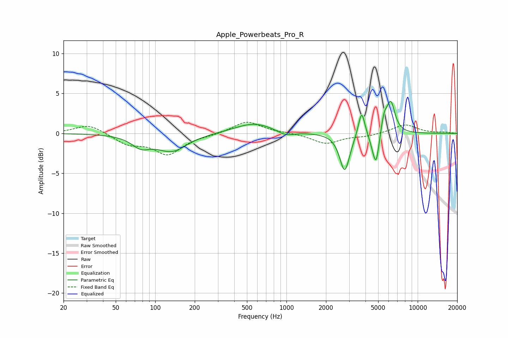

# Apple_Powerbeats_Pro_R
See [usage instructions](https://github.com/jaakkopasanen/AutoEq#usage) for more options and info.

### Parametric EQs
Apply preamp of -4.1 dB when using parametric equalizer.

|   # | Type    |   Fc (Hz) |    Q |   Gain (dB) |
|-----|---------|-----------|------|-------------|
|   1 | Peaking |        78 | 2.02 |        -1.3 |
|   2 | Peaking |       134 | 1.22 |        -2.1 |
|   3 | Peaking |       567 | 0.96 |         1.3 |
|   4 | Peaking |       985 | 2.21 |        -0.6 |
|   5 | Peaking |      2779 | 3.76 |        -4.8 |
|   6 | Peaking |      3737 | 5.78 |         3.3 |
|   7 | Peaking |      4563 | 5.09 |        -0.9 |
|   8 | Peaking |      4830 | 5.99 |        -3.7 |
|   9 | Peaking |      5540 | 6    |         1.9 |
|  10 | Peaking |      6237 | 4.28 |         3.9 |

### Fixed Band EQs
When using fixed band (also called graphic) equalizer, apply preamp of **-1.5 dB** (if available) and set gains manually with these parameters.

|   # | Type    |   Fc (Hz) |    Q |   Gain (dB) |
|-----|---------|-----------|------|-------------|
|   1 | Peaking |        31 | 1.41 |         1.2 |
|   2 | Peaking |        62 | 1.41 |        -1.3 |
|   3 | Peaking |       125 | 1.41 |        -2.5 |
|   4 | Peaking |       250 | 1.41 |        -0.2 |
|   5 | Peaking |       500 | 1.41 |         1.5 |
|   6 | Peaking |      1000 | 1.41 |         0.1 |
|   7 | Peaking |      2000 | 1.41 |        -1.3 |
|   8 | Peaking |      4000 | 1.41 |        -0.3 |
|   9 | Peaking |      8000 | 1.41 |         1.1 |
|  10 | Peaking |     16000 | 1.41 |         0.1 |

### Graphs

