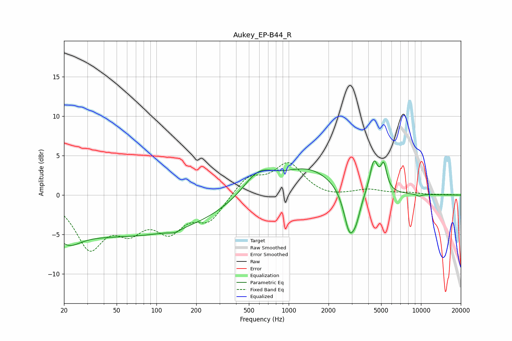

# Aukey_EP-B44_R
See [usage instructions](https://github.com/jaakkopasanen/AutoEq#usage) for more options and info.

### Parametric EQs
Apply preamp of -4.4 dB when using parametric equalizer.

|   # | Type    |   Fc (Hz) |    Q |   Gain (dB) |
|-----|---------|-----------|------|-------------|
|   1 | Peaking |        21 | 1.54 |        -2.1 |
|   2 | Peaking |        58 | 0.18 |        -5.2 |
|   3 | Peaking |       137 | 3.59 |        -0.4 |
|   4 | Peaking |       591 | 1.19 |         3   |
|   5 | Peaking |      1396 | 0.71 |         3.2 |
|   6 | Peaking |      2883 | 3.26 |        -5.4 |
|   7 | Peaking |      3250 | 4.19 |        -2.1 |
|   8 | Peaking |      4403 | 4.73 |         4   |
|   9 | Peaking |      5231 | 6    |         3.1 |
|  10 | Peaking |      9671 | 5.96 |        -0.3 |

### Fixed Band EQs
When using fixed band (also called graphic) equalizer, apply preamp of **-4.2 dB** (if available) and set gains manually with these parameters.

|   # | Type    |   Fc (Hz) |    Q |   Gain (dB) |
|-----|---------|-----------|------|-------------|
|   1 | Peaking |        31 | 1.41 |        -6.3 |
|   2 | Peaking |        62 | 1.41 |        -3.5 |
|   3 | Peaking |       125 | 1.41 |        -3.9 |
|   4 | Peaking |       250 | 1.41 |        -3   |
|   5 | Peaking |       500 | 1.41 |         2.3 |
|   6 | Peaking |      1000 | 1.41 |         3.9 |
|   7 | Peaking |      2000 | 1.41 |        -0.4 |
|   8 | Peaking |      4000 | 1.41 |         0.6 |
|   9 | Peaking |      8000 | 1.41 |         0.3 |
|  10 | Peaking |     16000 | 1.41 |         0   |

### Graphs

