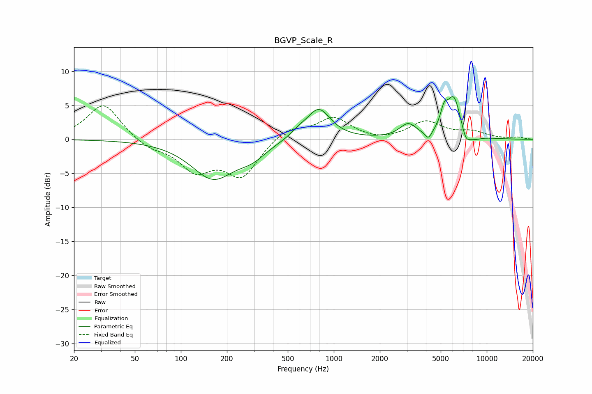

# BGVP_Scale_R
See [usage instructions](https://github.com/jaakkopasanen/AutoEq#usage) for more options and info.

### Parametric EQs
Apply preamp of -6.4 dB when using parametric equalizer.

|   # | Type    |   Fc (Hz) |    Q |   Gain (dB) |
|-----|---------|-----------|------|-------------|
|   1 | Peaking |       162 | 0.99 |        -5.6 |
|   2 | Peaking |       292 | 1.56 |        -1.6 |
|   3 | Peaking |       588 | 2.49 |         0.8 |
|   4 | Peaking |       797 | 1.82 |         4.5 |
|   5 | Peaking |      3057 | 2.6  |         2   |
|   6 | Peaking |      4153 | 6    |        -1.3 |
|   7 | Peaking |      5257 | 5.94 |         2.4 |
|   8 | Peaking |      6092 | 2.89 |         6.1 |
|   9 | Peaking |      7297 | 4.53 |        -2.1 |
|  10 | Peaking |      8414 | 3.26 |        -0.6 |

### Fixed Band EQs
When using fixed band (also called graphic) equalizer, apply preamp of **-5.0 dB** (if available) and set gains manually with these parameters.

|   # | Type    |   Fc (Hz) |    Q |   Gain (dB) |
|-----|---------|-----------|------|-------------|
|   1 | Peaking |        31 | 1.41 |         5.3 |
|   2 | Peaking |        62 | 1.41 |        -1.3 |
|   3 | Peaking |       125 | 1.41 |        -4.2 |
|   4 | Peaking |       250 | 1.41 |        -5.2 |
|   5 | Peaking |       500 | 1.41 |         1.8 |
|   6 | Peaking |      1000 | 1.41 |         3.1 |
|   7 | Peaking |      2000 | 1.41 |        -0.4 |
|   8 | Peaking |      4000 | 1.41 |         2.5 |
|   9 | Peaking |      8000 | 1.41 |         1   |
|  10 | Peaking |     16000 | 1.41 |         0.3 |

### Graphs

