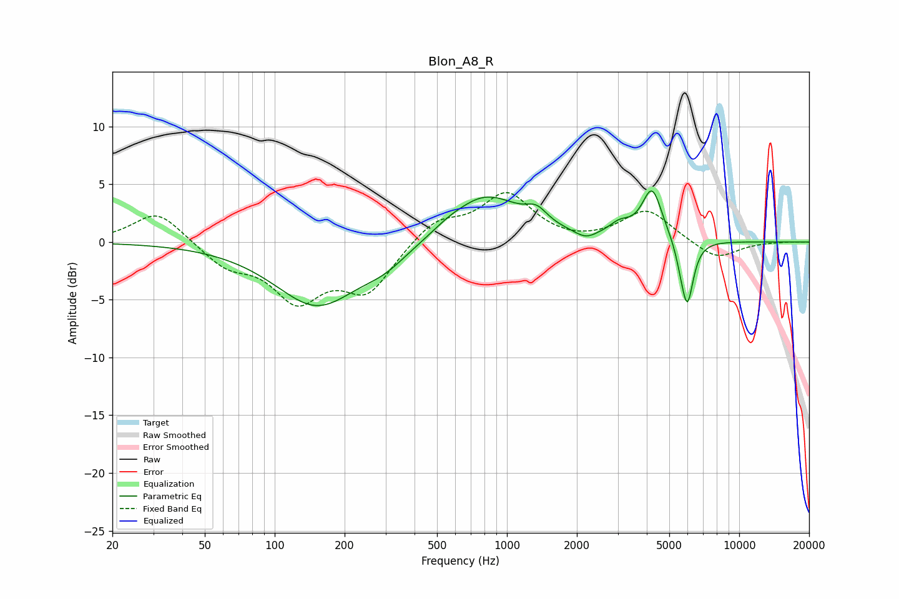

# Blon_A8_R
See [usage instructions](https://github.com/jaakkopasanen/AutoEq#usage) for more options and info.

### Parametric EQs
Apply preamp of -4.5 dB when using parametric equalizer.

|   # | Type    |   Fc (Hz) |    Q |   Gain (dB) |
|-----|---------|-----------|------|-------------|
|   1 | Peaking |       152 | 0.78 |        -5.5 |
|   2 | Peaking |       300 | 1.46 |        -1.1 |
|   3 | Peaking |       555 | 2.47 |         0.2 |
|   4 | Peaking |       804 | 0.91 |         4.1 |
|   5 | Peaking |      1343 | 3.06 |         1.2 |
|   6 | Peaking |      2183 | 3.22 |        -0.6 |
|   7 | Peaking |      3062 | 2.96 |         1   |
|   8 | Peaking |      4216 | 3.23 |         4.4 |
|   9 | Peaking |      5594 | 6    |        -0.8 |
|  10 | Peaking |      5979 | 5.22 |        -5.5 |

### Fixed Band EQs
When using fixed band (also called graphic) equalizer, apply preamp of **-4.4 dB** (if available) and set gains manually with these parameters.

|   # | Type    |   Fc (Hz) |    Q |   Gain (dB) |
|-----|---------|-----------|------|-------------|
|   1 | Peaking |        31 | 1.41 |         2.8 |
|   2 | Peaking |        62 | 1.41 |        -1.9 |
|   3 | Peaking |       125 | 1.41 |        -4.6 |
|   4 | Peaking |       250 | 1.41 |        -4.1 |
|   5 | Peaking |       500 | 1.41 |         1.9 |
|   6 | Peaking |      1000 | 1.41 |         4.1 |
|   7 | Peaking |      2000 | 1.41 |        -0.2 |
|   8 | Peaking |      4000 | 1.41 |         2.8 |
|   9 | Peaking |      8000 | 1.41 |        -1.6 |
|  10 | Peaking |     16000 | 1.41 |         0   |

### Graphs

