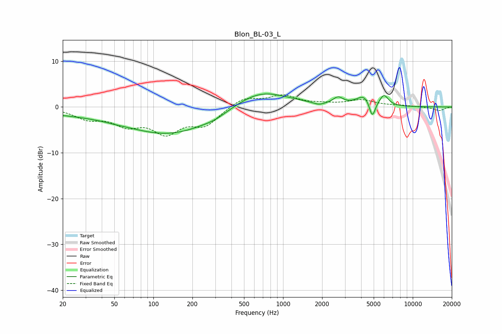

# Blon_BL-03_L
See [usage instructions](https://github.com/jaakkopasanen/AutoEq#usage) for more options and info.

### Parametric EQs
Apply preamp of -2.9 dB when using parametric equalizer.

|   # | Type    |   Fc (Hz) |    Q |   Gain (dB) |
|-----|---------|-----------|------|-------------|
|   1 | Peaking |        20 | 0.35 |        -1.1 |
|   2 | Peaking |        51 | 2.24 |        -0.1 |
|   3 | Peaking |       136 | 0.41 |        -5.8 |
|   4 | Peaking |       299 | 1.7  |        -0.6 |
|   5 | Peaking |       661 | 0.67 |         4   |
|   6 | Peaking |      1886 | 3.52 |        -0.5 |
|   7 | Peaking |      2654 | 3.64 |         1.5 |
|   8 | Peaking |      4223 | 2.47 |         2.3 |
|   9 | Peaking |      4873 | 6    |        -3.8 |
|  10 | Peaking |      5998 | 4.09 |         2.3 |

### Fixed Band EQs
When using fixed band (also called graphic) equalizer, apply preamp of **-2.8 dB** (if available) and set gains manually with these parameters.

|   # | Type    |   Fc (Hz) |    Q |   Gain (dB) |
|-----|---------|-----------|------|-------------|
|   1 | Peaking |        31 | 1.41 |        -2.2 |
|   2 | Peaking |        62 | 1.41 |        -3.3 |
|   3 | Peaking |       125 | 1.41 |        -5.1 |
|   4 | Peaking |       250 | 1.41 |        -3.7 |
|   5 | Peaking |       500 | 1.41 |         2.1 |
|   6 | Peaking |      1000 | 1.41 |         2.3 |
|   7 | Peaking |      2000 | 1.41 |         0.5 |
|   8 | Peaking |      4000 | 1.41 |         1.4 |
|   9 | Peaking |      8000 | 1.41 |         0.3 |
|  10 | Peaking |     16000 | 1.41 |        -0.8 |

### Graphs

