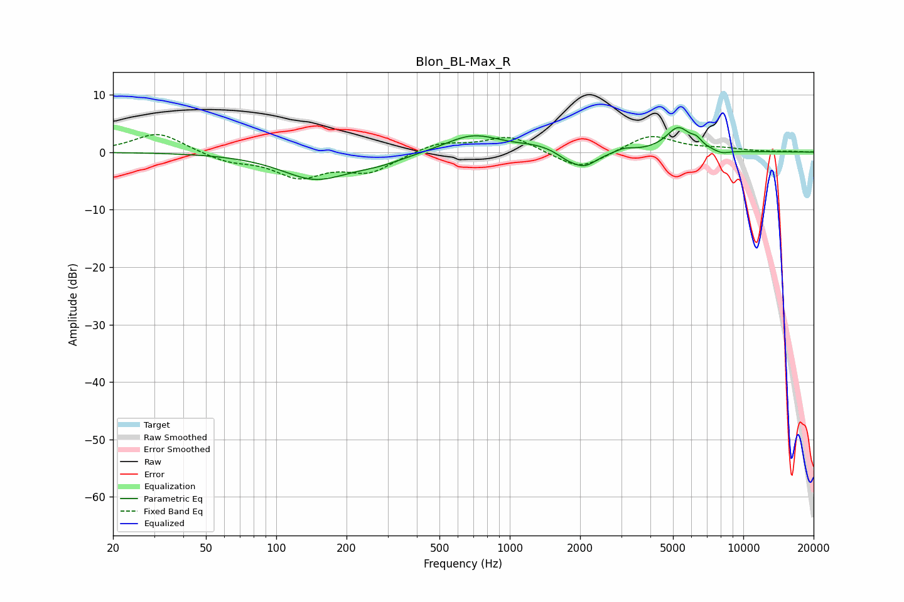

# Blon_BL-Max_R
See [usage instructions](https://github.com/jaakkopasanen/AutoEq#usage) for more options and info.

### Parametric EQs
Apply preamp of -4.4 dB when using parametric equalizer.

|   # | Type    |   Fc (Hz) |    Q |   Gain (dB) |
|-----|---------|-----------|------|-------------|
|   1 | Peaking |       147 | 0.97 |        -4.5 |
|   2 | Peaking |       278 | 1.18 |        -1.3 |
|   3 | Peaking |       694 | 1.18 |         3.1 |
|   4 | Peaking |      1308 | 1.53 |         0.8 |
|   5 | Peaking |      1738 | 3.68 |        -0.7 |
|   6 | Peaking |      2071 | 2.47 |        -2.8 |
|   7 | Peaking |      3098 | 3.6  |         0.6 |
|   8 | Peaking |      5264 | 2.68 |         4.2 |
|   9 | Peaking |      6310 | 6    |         1.1 |
|  10 | Peaking |      8102 | 3.74 |        -0.6 |

### Fixed Band EQs
When using fixed band (also called graphic) equalizer, apply preamp of **-3.1 dB** (if available) and set gains manually with these parameters.

|   # | Type    |   Fc (Hz) |    Q |   Gain (dB) |
|-----|---------|-----------|------|-------------|
|   1 | Peaking |        31 | 1.41 |         3.5 |
|   2 | Peaking |        62 | 1.41 |        -1.5 |
|   3 | Peaking |       125 | 1.41 |        -4   |
|   4 | Peaking |       250 | 1.41 |        -3.2 |
|   5 | Peaking |       500 | 1.41 |         1.7 |
|   6 | Peaking |      1000 | 1.41 |         2.8 |
|   7 | Peaking |      2000 | 1.41 |        -3.3 |
|   8 | Peaking |      4000 | 1.41 |         3.1 |
|   9 | Peaking |      8000 | 1.41 |         0.5 |
|  10 | Peaking |     16000 | 1.41 |         0.1 |

### Graphs

