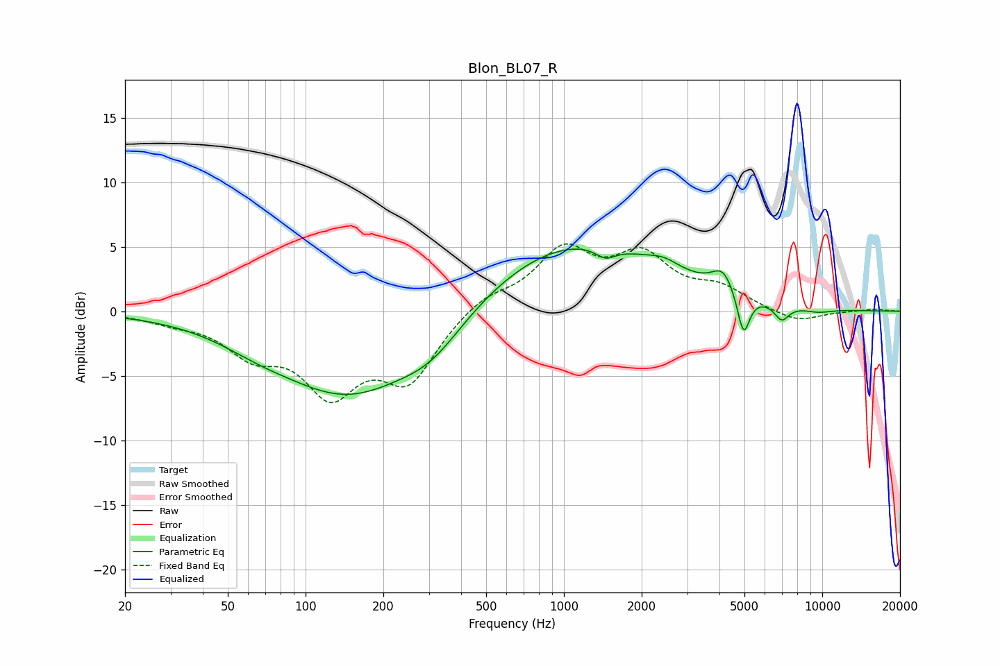

# Blon_BL07_R
See [usage instructions](https://github.com/jaakkopasanen/AutoEq#usage) for more options and info.

### Parametric EQs
Apply preamp of -4.9 dB when using parametric equalizer.

|   # | Type    |   Fc (Hz) |    Q |   Gain (dB) |
|-----|---------|-----------|------|-------------|
|   1 | Peaking |        64 | 1.05 |        -0.7 |
|   2 | Peaking |       147 | 0.5  |        -6.4 |
|   3 | Peaking |       309 | 1.11 |        -2   |
|   4 | Peaking |      1093 | 0.39 |         5.6 |
|   5 | Peaking |      1450 | 3.55 |        -0.9 |
|   6 | Peaking |      2434 | 2.42 |         0.6 |
|   7 | Peaking |      4126 | 3.29 |         1.7 |
|   8 | Peaking |      4958 | 5.91 |        -3.3 |
|   9 | Peaking |      6966 | 4.75 |        -1.3 |
|  10 | Peaking |      9589 | 2.12 |        -0.3 |

### Fixed Band EQs
When using fixed band (also called graphic) equalizer, apply preamp of **-5.3 dB** (if available) and set gains manually with these parameters.

|   # | Type    |   Fc (Hz) |    Q |   Gain (dB) |
|-----|---------|-----------|------|-------------|
|   1 | Peaking |        31 | 1.41 |        -0.6 |
|   2 | Peaking |        62 | 1.41 |        -2.8 |
|   3 | Peaking |       125 | 1.41 |        -5.7 |
|   4 | Peaking |       250 | 1.41 |        -5   |
|   5 | Peaking |       500 | 1.41 |         1.2 |
|   6 | Peaking |      1000 | 1.41 |         4.5 |
|   7 | Peaking |      2000 | 1.41 |         3.9 |
|   8 | Peaking |      4000 | 1.41 |         1.5 |
|   9 | Peaking |      8000 | 1.41 |        -0.9 |
|  10 | Peaking |     16000 | 1.41 |         0.2 |

### Graphs

