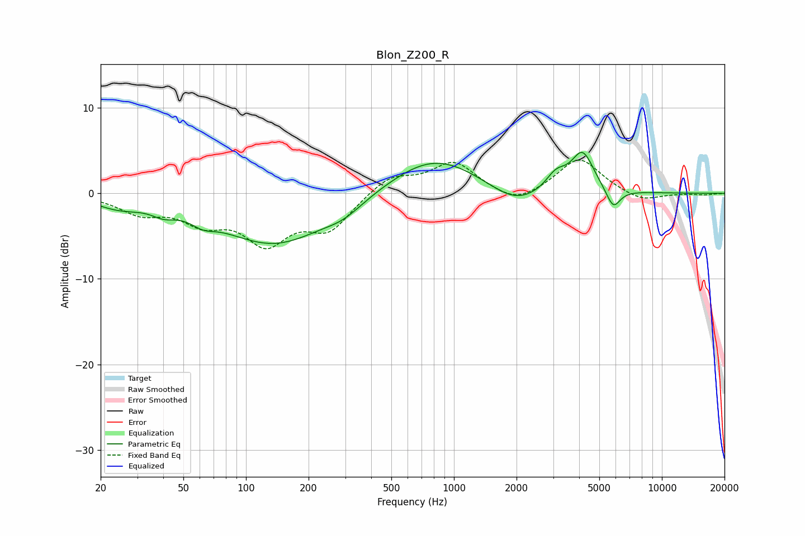

# Blon_Z200_R
See [usage instructions](https://github.com/jaakkopasanen/AutoEq#usage) for more options and info.

### Parametric EQs
Apply preamp of -4.9 dB when using parametric equalizer.

|   # | Type    |   Fc (Hz) |    Q |   Gain (dB) |
|-----|---------|-----------|------|-------------|
|   1 | Peaking |        24 | 1.27 |        -1.2 |
|   2 | Peaking |        40 | 2.59 |        -0.9 |
|   3 | Peaking |        62 | 2.51 |        -1   |
|   4 | Peaking |       137 | 0.54 |        -5.9 |
|   5 | Peaking |       295 | 1.54 |        -1.1 |
|   6 | Peaking |       802 | 0.65 |         4.5 |
|   7 | Peaking |      1972 | 1.15 |        -2.2 |
|   8 | Peaking |      3099 | 2.86 |         1.9 |
|   9 | Peaking |      4153 | 2.57 |         4.6 |
|  10 | Peaking |      5835 | 4.1  |        -2.4 |

### Fixed Band EQs
When using fixed band (also called graphic) equalizer, apply preamp of **-4.0 dB** (if available) and set gains manually with these parameters.

|   # | Type    |   Fc (Hz) |    Q |   Gain (dB) |
|-----|---------|-----------|------|-------------|
|   1 | Peaking |        31 | 1.41 |        -2   |
|   2 | Peaking |        62 | 1.41 |        -2.8 |
|   3 | Peaking |       125 | 1.41 |        -5.3 |
|   4 | Peaking |       250 | 1.41 |        -3.9 |
|   5 | Peaking |       500 | 1.41 |         2.1 |
|   6 | Peaking |      1000 | 1.41 |         3.6 |
|   7 | Peaking |      2000 | 1.41 |        -1.5 |
|   8 | Peaking |      4000 | 1.41 |         4.2 |
|   9 | Peaking |      8000 | 1.41 |        -1.1 |
|  10 | Peaking |     16000 | 1.41 |        -0.2 |

### Graphs

