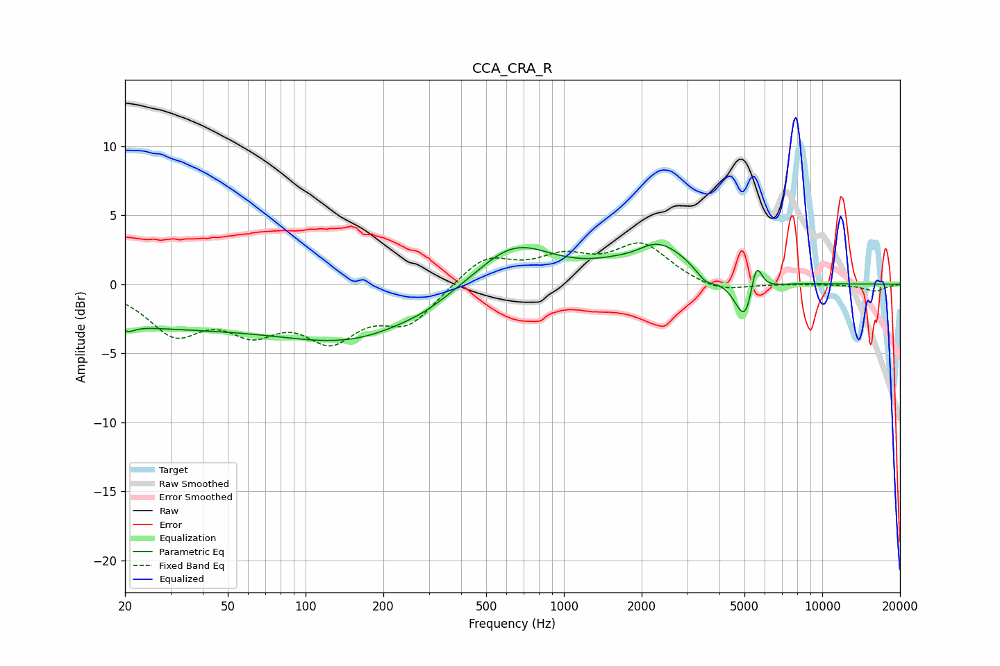

# CCA_CRA_R
See [usage instructions](https://github.com/jaakkopasanen/AutoEq#usage) for more options and info.

### Parametric EQs
Apply preamp of -3.0 dB when using parametric equalizer.

|   # | Type    |   Fc (Hz) |    Q |   Gain (dB) |
|-----|---------|-----------|------|-------------|
|   1 | Peaking |        21 | 5.66 |        -0.4 |
|   2 | Peaking |        25 | 0.28 |        -2.8 |
|   3 | Peaking |       158 | 0.5  |        -3.4 |
|   4 | Peaking |       288 | 1.77 |        -0.2 |
|   5 | Peaking |       638 | 0.94 |         3.2 |
|   6 | Peaking |      1916 | 1.85 |        -1   |
|   7 | Peaking |      2191 | 1.11 |         3.5 |
|   8 | Peaking |      3545 | 3.68 |        -0.9 |
|   9 | Peaking |      5082 | 3.35 |        -3.7 |
|  10 | Peaking |      5535 | 5.85 |         3.1 |

### Fixed Band EQs
When using fixed band (also called graphic) equalizer, apply preamp of **-3.1 dB** (if available) and set gains manually with these parameters.

|   # | Type    |   Fc (Hz) |    Q |   Gain (dB) |
|-----|---------|-----------|------|-------------|
|   1 | Peaking |        31 | 1.41 |        -3.3 |
|   2 | Peaking |        62 | 1.41 |        -2.7 |
|   3 | Peaking |       125 | 1.41 |        -3.5 |
|   4 | Peaking |       250 | 1.41 |        -2.6 |
|   5 | Peaking |       500 | 1.41 |         2   |
|   6 | Peaking |      1000 | 1.41 |         1.7 |
|   7 | Peaking |      2000 | 1.41 |         2.8 |
|   8 | Peaking |      4000 | 1.41 |        -0.7 |
|   9 | Peaking |      8000 | 1.41 |         0   |
|  10 | Peaking |     16000 | 1.41 |        -0.5 |

### Graphs

