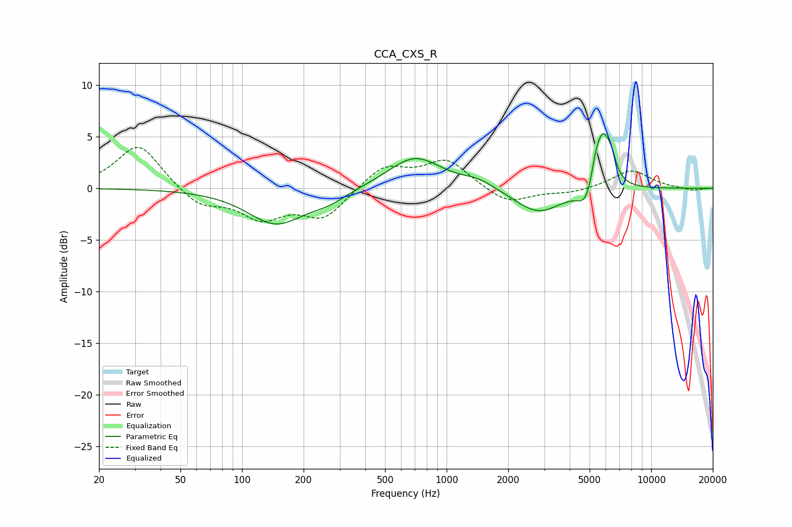

# CCA_CXS_R
See [usage instructions](https://github.com/jaakkopasanen/AutoEq#usage) for more options and info.

### Parametric EQs
Apply preamp of -5.4 dB when using parametric equalizer.

|   # | Type    |   Fc (Hz) |    Q |   Gain (dB) |
|-----|---------|-----------|------|-------------|
|   1 | Peaking |       147 | 1.02 |        -3.4 |
|   2 | Peaking |       265 | 1.57 |        -0.9 |
|   3 | Peaking |       700 | 1.08 |         3.1 |
|   4 | Peaking |      1432 | 1.79 |         0.7 |
|   5 | Peaking |      2802 | 1.21 |        -2.5 |
|   6 | Peaking |      4701 | 4.14 |        -0.6 |
|   7 | Peaking |      4922 | 3.27 |        -1.7 |
|   8 | Peaking |      5342 | 6    |         1.7 |
|   9 | Peaking |      5808 | 3.64 |         5.3 |
|  10 | Peaking |      6408 | 6    |         1.3 |

### Fixed Band EQs
When using fixed band (also called graphic) equalizer, apply preamp of **-4.1 dB** (if available) and set gains manually with these parameters.

|   # | Type    |   Fc (Hz) |    Q |   Gain (dB) |
|-----|---------|-----------|------|-------------|
|   1 | Peaking |        31 | 1.41 |         4.4 |
|   2 | Peaking |        62 | 1.41 |        -1.7 |
|   3 | Peaking |       125 | 1.41 |        -2.7 |
|   4 | Peaking |       250 | 1.41 |        -2.8 |
|   5 | Peaking |       500 | 1.41 |         2.2 |
|   6 | Peaking |      1000 | 1.41 |         2.7 |
|   7 | Peaking |      2000 | 1.41 |        -1.6 |
|   8 | Peaking |      4000 | 1.41 |        -0.4 |
|   9 | Peaking |      8000 | 1.41 |         1.8 |
|  10 | Peaking |     16000 | 1.41 |        -0.3 |

### Graphs

