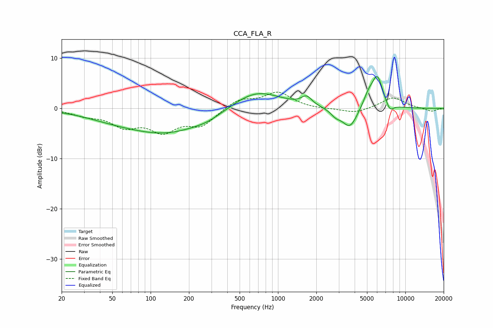

# CCA_FLA_R
See [usage instructions](https://github.com/jaakkopasanen/AutoEq#usage) for more options and info.

### Parametric EQs
Apply preamp of -6.5 dB when using parametric equalizer.

|   # | Type    |   Fc (Hz) |    Q |   Gain (dB) |
|-----|---------|-----------|------|-------------|
|   1 | Peaking |        47 | 0.65 |        -0.9 |
|   2 | Peaking |       134 | 0.44 |        -4.7 |
|   3 | Peaking |       281 | 1.37 |        -0.6 |
|   4 | Peaking |       672 | 0.74 |         3.8 |
|   5 | Peaking |      1677 | 3.46 |         1.7 |
|   6 | Peaking |      2836 | 3.49 |        -1.2 |
|   7 | Peaking |      3669 | 2.36 |        -4.1 |
|   8 | Peaking |      5121 | 3.36 |         2.1 |
|   9 | Peaking |      6022 | 3.1  |         6.2 |
|  10 | Peaking |      7555 | 4.57 |        -1.7 |

### Fixed Band EQs
When using fixed band (also called graphic) equalizer, apply preamp of **-3.3 dB** (if available) and set gains manually with these parameters.

|   # | Type    |   Fc (Hz) |    Q |   Gain (dB) |
|-----|---------|-----------|------|-------------|
|   1 | Peaking |        31 | 1.41 |        -1.2 |
|   2 | Peaking |        62 | 1.41 |        -3.1 |
|   3 | Peaking |       125 | 1.41 |        -4.1 |
|   4 | Peaking |       250 | 1.41 |        -3.2 |
|   5 | Peaking |       500 | 1.41 |         1.9 |
|   6 | Peaking |      1000 | 1.41 |         3.1 |
|   7 | Peaking |      2000 | 1.41 |        -0.2 |
|   8 | Peaking |      4000 | 1.41 |        -1   |
|   9 | Peaking |      8000 | 1.41 |         2.2 |
|  10 | Peaking |     16000 | 1.41 |        -0.6 |

### Graphs

