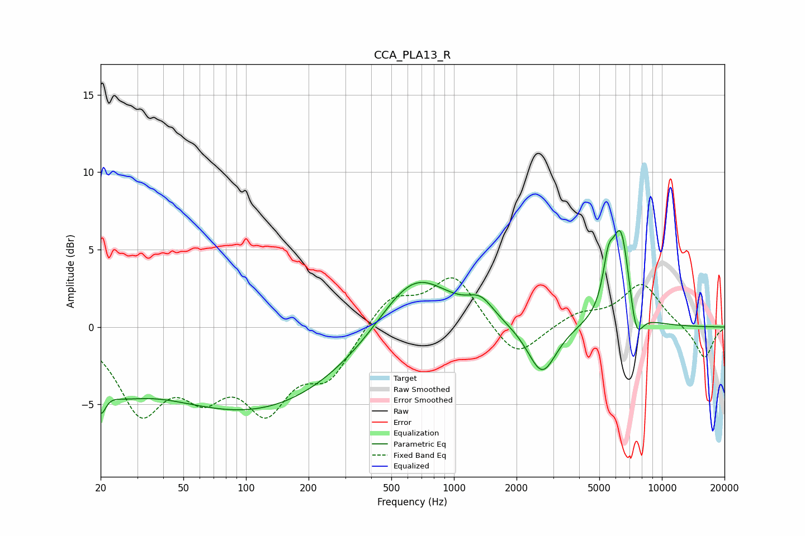

# CCA_PLA13_R
See [usage instructions](https://github.com/jaakkopasanen/AutoEq#usage) for more options and info.

### Parametric EQs
Apply preamp of -6.3 dB when using parametric equalizer.

|   # | Type    |   Fc (Hz) |    Q |   Gain (dB) |
|-----|---------|-----------|------|-------------|
|   1 | Peaking |        20 | 6    |        -1.9 |
|   2 | Peaking |        23 | 1.06 |        -1.9 |
|   3 | Peaking |        82 | 0.3  |        -4.3 |
|   4 | Peaking |       263 | 0.28 |        -1.6 |
|   5 | Peaking |       642 | 0.8  |         4.7 |
|   6 | Peaking |      1345 | 2.24 |         1.2 |
|   7 | Peaking |      2655 | 2.08 |        -3.2 |
|   8 | Peaking |      5516 | 5.52 |         2.4 |
|   9 | Peaking |      6355 | 2.98 |         6.4 |
|  10 | Peaking |      7503 | 4.05 |        -2.6 |

### Fixed Band EQs
When using fixed band (also called graphic) equalizer, apply preamp of **-3.3 dB** (if available) and set gains manually with these parameters.

|   # | Type    |   Fc (Hz) |    Q |   Gain (dB) |
|-----|---------|-----------|------|-------------|
|   1 | Peaking |        31 | 1.41 |        -5.1 |
|   2 | Peaking |        62 | 1.41 |        -3.3 |
|   3 | Peaking |       125 | 1.41 |        -4.6 |
|   4 | Peaking |       250 | 1.41 |        -2.9 |
|   5 | Peaking |       500 | 1.41 |         2   |
|   6 | Peaking |      1000 | 1.41 |         3.3 |
|   7 | Peaking |      2000 | 1.41 |        -2.2 |
|   8 | Peaking |      4000 | 1.41 |         0.8 |
|   9 | Peaking |      8000 | 1.41 |         2.8 |
|  10 | Peaking |     16000 | 1.41 |        -2.1 |

### Graphs

