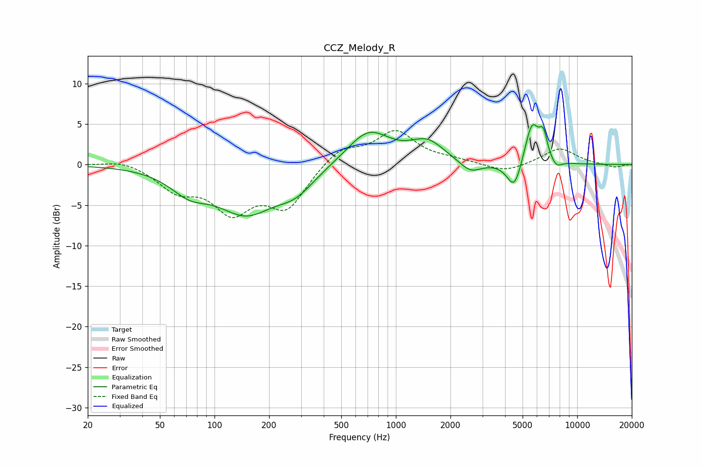

# CCZ_Melody_R
See [usage instructions](https://github.com/jaakkopasanen/AutoEq#usage) for more options and info.

### Parametric EQs
Apply preamp of -5.0 dB when using parametric equalizer.

|   # | Type    |   Fc (Hz) |    Q |   Gain (dB) |
|-----|---------|-----------|------|-------------|
|   1 | Peaking |        73 | 1.32 |        -2.4 |
|   2 | Peaking |       149 | 0.87 |        -5.5 |
|   3 | Peaking |       279 | 1.34 |        -2.4 |
|   4 | Peaking |       706 | 1.19 |         4.2 |
|   5 | Peaking |      1492 | 1.5  |         2.5 |
|   6 | Peaking |      2578 | 2.38 |        -1.4 |
|   7 | Peaking |      4500 | 3.49 |        -3.6 |
|   8 | Peaking |      5628 | 3.5  |         5.1 |
|   9 | Peaking |      6501 | 5.98 |         2.9 |
|  10 | Peaking |      7657 | 4.54 |        -0.9 |

### Fixed Band EQs
When using fixed band (also called graphic) equalizer, apply preamp of **-4.3 dB** (if available) and set gains manually with these parameters.

|   # | Type    |   Fc (Hz) |    Q |   Gain (dB) |
|-----|---------|-----------|------|-------------|
|   1 | Peaking |        31 | 1.41 |         0.7 |
|   2 | Peaking |        62 | 1.41 |        -2.8 |
|   3 | Peaking |       125 | 1.41 |        -5.2 |
|   4 | Peaking |       250 | 1.41 |        -5   |
|   5 | Peaking |       500 | 1.41 |         2.1 |
|   6 | Peaking |      1000 | 1.41 |         4   |
|   7 | Peaking |      2000 | 1.41 |         0.5 |
|   8 | Peaking |      4000 | 1.41 |        -1   |
|   9 | Peaking |      8000 | 1.41 |         2   |
|  10 | Peaking |     16000 | 1.41 |        -0.4 |

### Graphs

