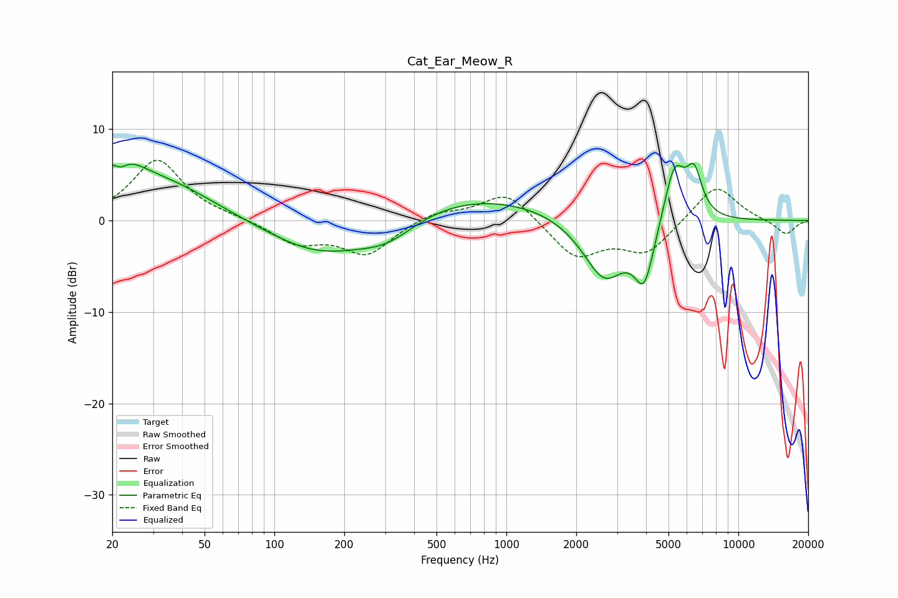

# Cat_Ear_Meow_R
See [usage instructions](https://github.com/jaakkopasanen/AutoEq#usage) for more options and info.

### Parametric EQs
Apply preamp of -6.3 dB when using parametric equalizer.

|   # | Type    |   Fc (Hz) |    Q |   Gain (dB) |
|-----|---------|-----------|------|-------------|
|   1 | Peaking |        21 | 1.28 |         4.9 |
|   2 | Peaking |        22 | 4.94 |        -1.1 |
|   3 | Peaking |        36 | 0.65 |         3.4 |
|   4 | Peaking |       159 | 0.63 |        -4.1 |
|   5 | Peaking |       308 | 1.08 |        -2.5 |
|   6 | Peaking |       644 | 0.34 |         3   |
|   7 | Peaking |      2643 | 1.47 |        -6.9 |
|   8 | Peaking |      3932 | 3.23 |        -6.2 |
|   9 | Peaking |      5308 | 2.95 |         6.6 |
|  10 | Peaking |      6453 | 4.05 |         4.5 |

### Fixed Band EQs
When using fixed band (also called graphic) equalizer, apply preamp of **-6.7 dB** (if available) and set gains manually with these parameters.

|   # | Type    |   Fc (Hz) |    Q |   Gain (dB) |
|-----|---------|-----------|------|-------------|
|   1 | Peaking |        31 | 1.41 |         6.6 |
|   2 | Peaking |        62 | 1.41 |         0.2 |
|   3 | Peaking |       125 | 1.41 |        -2.4 |
|   4 | Peaking |       250 | 1.41 |        -3.6 |
|   5 | Peaking |       500 | 1.41 |         1   |
|   6 | Peaking |      1000 | 1.41 |         3.3 |
|   7 | Peaking |      2000 | 1.41 |        -4   |
|   8 | Peaking |      4000 | 1.41 |        -3.4 |
|   9 | Peaking |      8000 | 1.41 |         4.1 |
|  10 | Peaking |     16000 | 1.41 |        -1.6 |

### Graphs

