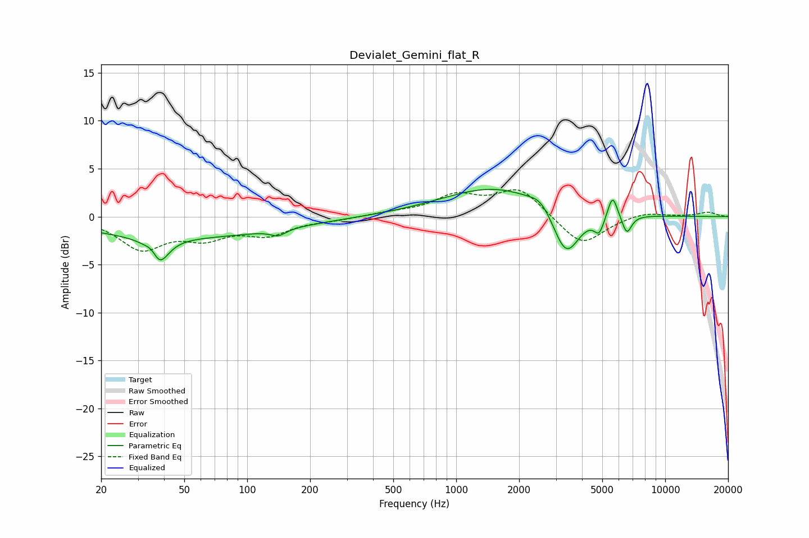

# Devialet_Gemini_flat_R
See [usage instructions](https://github.com/jaakkopasanen/AutoEq#usage) for more options and info.

### Parametric EQs
Apply preamp of -2.9 dB when using parametric equalizer.

|   # | Type    |   Fc (Hz) |    Q |   Gain (dB) |
|-----|---------|-----------|------|-------------|
|   1 | Peaking |        35 | 4.42 |         1.6 |
|   2 | Peaking |        37 | 3.2  |        -3.6 |
|   3 | Peaking |        49 | 0.28 |        -2.1 |
|   4 | Peaking |       141 | 3.92 |        -0.7 |
|   5 | Peaking |      1547 | 0.56 |         3.1 |
|   6 | Peaking |      2547 | 2.82 |         1.1 |
|   7 | Peaking |      3356 | 2.18 |        -5.1 |
|   8 | Peaking |      4833 | 5.96 |        -1.7 |
|   9 | Peaking |      5600 | 6    |         2.5 |
|  10 | Peaking |      6552 | 5.99 |        -2   |

### Fixed Band EQs
When using fixed band (also called graphic) equalizer, apply preamp of **-2.9 dB** (if available) and set gains manually with these parameters.

|   # | Type    |   Fc (Hz) |    Q |   Gain (dB) |
|-----|---------|-----------|------|-------------|
|   1 | Peaking |        31 | 1.41 |        -3.2 |
|   2 | Peaking |        62 | 1.41 |        -1.9 |
|   3 | Peaking |       125 | 1.41 |        -1.7 |
|   4 | Peaking |       250 | 1.41 |        -0.3 |
|   5 | Peaking |       500 | 1.41 |         0.3 |
|   6 | Peaking |      1000 | 1.41 |         2   |
|   7 | Peaking |      2000 | 1.41 |         2.9 |
|   8 | Peaking |      4000 | 1.41 |        -3.1 |
|   9 | Peaking |      8000 | 1.41 |         0.5 |
|  10 | Peaking |     16000 | 1.41 |         0.5 |

### Graphs

