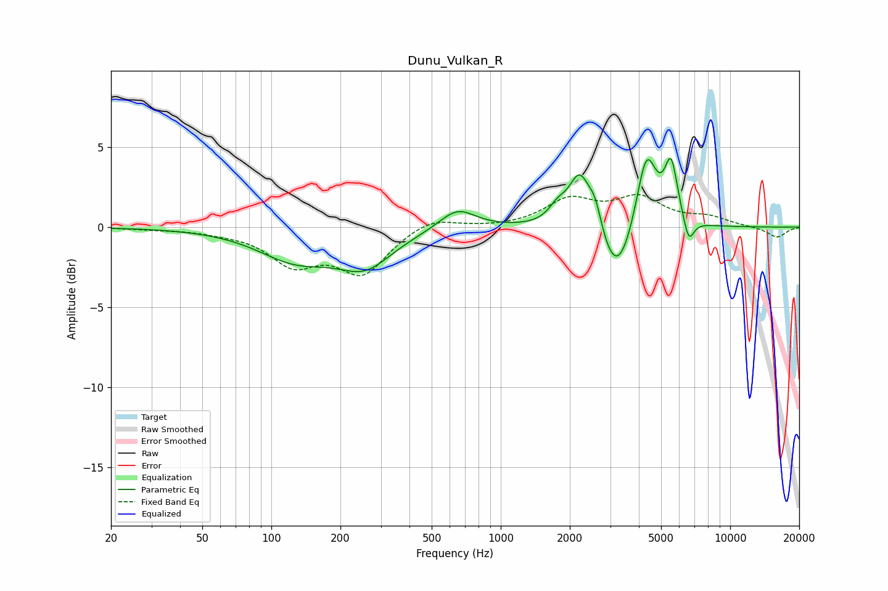

# Dunu_Vulkan_R
See [usage instructions](https://github.com/jaakkopasanen/AutoEq#usage) for more options and info.

### Parametric EQs
Apply preamp of -4.4 dB when using parametric equalizer.

|   # | Type    |   Fc (Hz) |    Q |   Gain (dB) |
|-----|---------|-----------|------|-------------|
|   1 | Peaking |       128 | 0.86 |        -1.9 |
|   2 | Peaking |       256 | 1.18 |        -2.1 |
|   3 | Peaking |       647 | 1.77 |         1.3 |
|   4 | Peaking |      1767 | 3.7  |         0.8 |
|   5 | Peaking |      2213 | 2.87 |         3.5 |
|   6 | Peaking |      2586 | 4.92 |         1.5 |
|   7 | Peaking |      3209 | 1.94 |        -3.8 |
|   8 | Peaking |      4315 | 3.12 |         5   |
|   9 | Peaking |      5530 | 4.86 |         3.6 |
|  10 | Peaking |      6600 | 6    |        -1.5 |

### Fixed Band EQs
When using fixed band (also called graphic) equalizer, apply preamp of **-2.1 dB** (if available) and set gains manually with these parameters.

|   # | Type    |   Fc (Hz) |    Q |   Gain (dB) |
|-----|---------|-----------|------|-------------|
|   1 | Peaking |        31 | 1.41 |        -0.1 |
|   2 | Peaking |        62 | 1.41 |        -0.2 |
|   3 | Peaking |       125 | 1.41 |        -2.1 |
|   4 | Peaking |       250 | 1.41 |        -2.7 |
|   5 | Peaking |       500 | 1.41 |         0.7 |
|   6 | Peaking |      1000 | 1.41 |        -0   |
|   7 | Peaking |      2000 | 1.41 |         1.6 |
|   8 | Peaking |      4000 | 1.41 |         1.7 |
|   9 | Peaking |      8000 | 1.41 |         0.5 |
|  10 | Peaking |     16000 | 1.41 |        -0.7 |

### Graphs

