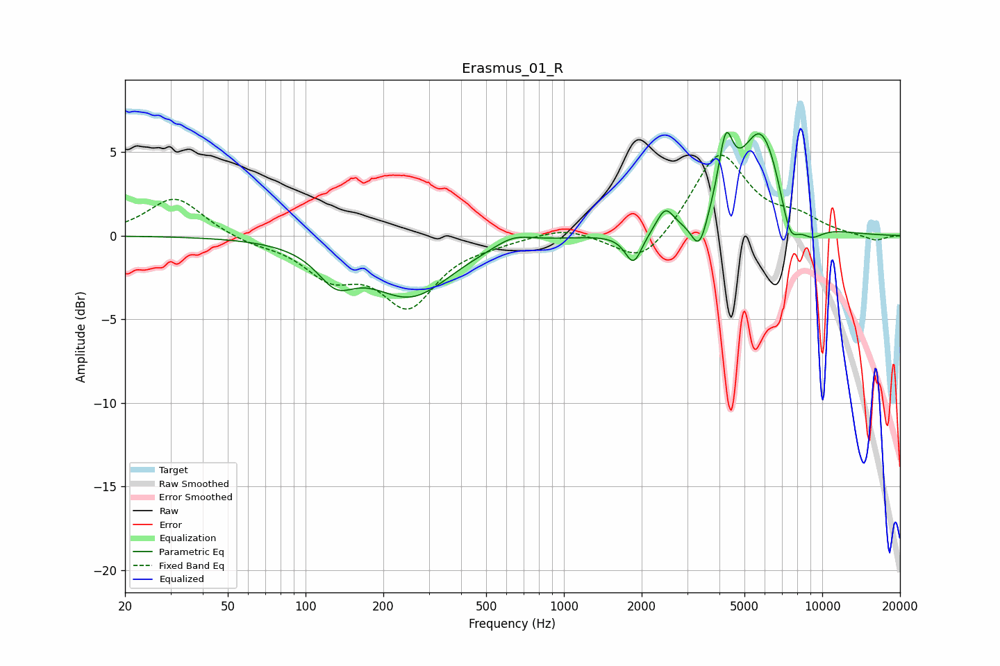

# Erasmus_01_R
See [usage instructions](https://github.com/jaakkopasanen/AutoEq#usage) for more options and info.

### Parametric EQs
Apply preamp of -6.3 dB when using parametric equalizer.

|   # | Type    |   Fc (Hz) |    Q |   Gain (dB) |
|-----|---------|-----------|------|-------------|
|   1 | Peaking |       131 | 1.97 |        -1.9 |
|   2 | Peaking |       255 | 0.89 |        -3.5 |
|   3 | Peaking |       635 | 1.95 |         0.6 |
|   4 | Peaking |      1861 | 4.34 |        -1.9 |
|   5 | Peaking |      2467 | 4.27 |         1.4 |
|   6 | Peaking |      3345 | 4.52 |        -2.1 |
|   7 | Peaking |      4229 | 5.04 |         3.8 |
|   8 | Peaking |      5809 | 1.63 |         6.4 |
|   9 | Peaking |      7482 | 3.6  |        -2.5 |
|  10 | Peaking |      9039 | 2.54 |        -1   |

### Fixed Band EQs
When using fixed band (also called graphic) equalizer, apply preamp of **-4.9 dB** (if available) and set gains manually with these parameters.

|   # | Type    |   Fc (Hz) |    Q |   Gain (dB) |
|-----|---------|-----------|------|-------------|
|   1 | Peaking |        31 | 1.41 |         2.3 |
|   2 | Peaking |        62 | 1.41 |        -0.4 |
|   3 | Peaking |       125 | 1.41 |        -2.2 |
|   4 | Peaking |       250 | 1.41 |        -4   |
|   5 | Peaking |       500 | 1.41 |        -0.3 |
|   6 | Peaking |      1000 | 1.41 |         0.6 |
|   7 | Peaking |      2000 | 1.41 |        -1.9 |
|   8 | Peaking |      4000 | 1.41 |         5   |
|   9 | Peaking |      8000 | 1.41 |         0.9 |
|  10 | Peaking |     16000 | 1.41 |        -0.3 |

### Graphs

