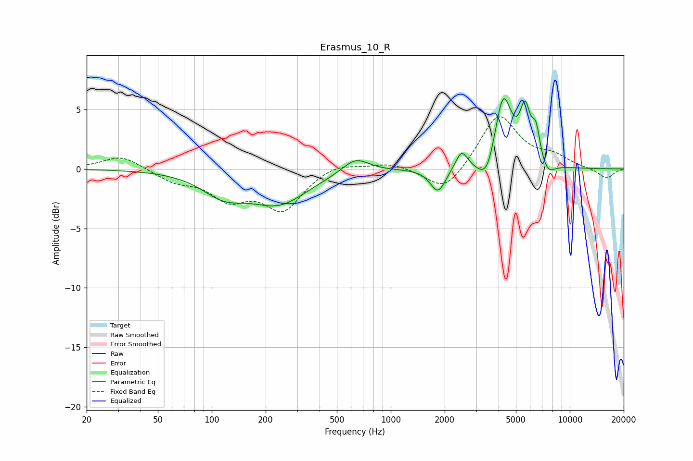

# Erasmus_10_R
See [usage instructions](https://github.com/jaakkopasanen/AutoEq#usage) for more options and info.

### Parametric EQs
Apply preamp of -6.0 dB when using parametric equalizer.

|   # | Type    |   Fc (Hz) |    Q |   Gain (dB) |
|-----|---------|-----------|------|-------------|
|   1 | Peaking |       117 | 1.15 |        -1.8 |
|   2 | Peaking |       238 | 0.88 |        -2.7 |
|   3 | Peaking |       635 | 1.93 |         1.3 |
|   4 | Peaking |      1837 | 3.31 |        -2   |
|   5 | Peaking |      2485 | 4.27 |         1.6 |
|   6 | Peaking |      3456 | 2.8  |        -2.4 |
|   7 | Peaking |      4230 | 2.84 |         6.4 |
|   8 | Peaking |      5626 | 4.71 |         4   |
|   9 | Peaking |      6473 | 5.86 |         2.5 |
|  10 | Peaking |      7514 | 3.47 |        -1.1 |

### Fixed Band EQs
When using fixed band (also called graphic) equalizer, apply preamp of **-4.5 dB** (if available) and set gains manually with these parameters.

|   # | Type    |   Fc (Hz) |    Q |   Gain (dB) |
|-----|---------|-----------|------|-------------|
|   1 | Peaking |        31 | 1.41 |         1.2 |
|   2 | Peaking |        62 | 1.41 |        -0.9 |
|   3 | Peaking |       125 | 1.41 |        -2.2 |
|   4 | Peaking |       250 | 1.41 |        -3.3 |
|   5 | Peaking |       500 | 1.41 |         0.6 |
|   6 | Peaking |      1000 | 1.41 |         0.5 |
|   7 | Peaking |      2000 | 1.41 |        -2.1 |
|   8 | Peaking |      4000 | 1.41 |         4.6 |
|   9 | Peaking |      8000 | 1.41 |         0.9 |
|  10 | Peaking |     16000 | 1.41 |        -0.8 |

### Graphs

