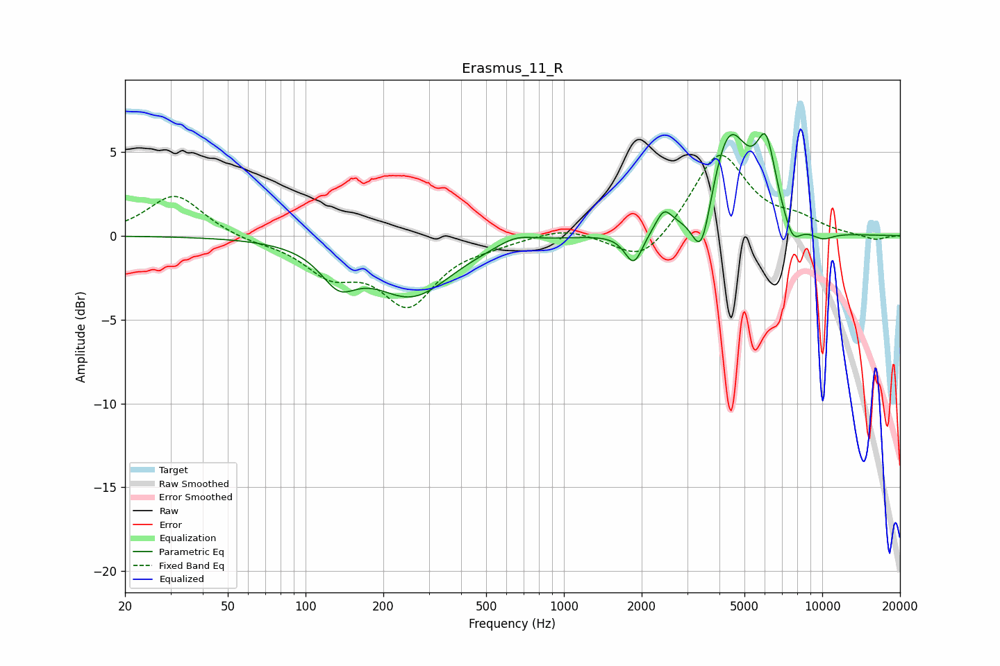

# Erasmus_11_R
See [usage instructions](https://github.com/jaakkopasanen/AutoEq#usage) for more options and info.

### Parametric EQs
Apply preamp of -6.2 dB when using parametric equalizer.

|   # | Type    |   Fc (Hz) |    Q |   Gain (dB) |
|-----|---------|-----------|------|-------------|
|   1 | Peaking |       135 | 2.04 |        -2   |
|   2 | Peaking |       258 | 0.92 |        -3.4 |
|   3 | Peaking |       649 | 2.01 |         0.6 |
|   4 | Peaking |      1865 | 4.05 |        -1.9 |
|   5 | Peaking |      2438 | 4.65 |         1.2 |
|   6 | Peaking |      3412 | 3.71 |        -3.7 |
|   7 | Peaking |      4347 | 1.8  |         6.3 |
|   8 | Peaking |      6062 | 3.67 |         4.2 |
|   9 | Peaking |      7667 | 3.88 |        -1.4 |
|  10 | Peaking |     10000 | 2.62 |        -0.5 |

### Fixed Band EQs
When using fixed band (also called graphic) equalizer, apply preamp of **-4.9 dB** (if available) and set gains manually with these parameters.

|   # | Type    |   Fc (Hz) |    Q |   Gain (dB) |
|-----|---------|-----------|------|-------------|
|   1 | Peaking |        31 | 1.41 |         2.5 |
|   2 | Peaking |        62 | 1.41 |        -0.3 |
|   3 | Peaking |       125 | 1.41 |        -2   |
|   4 | Peaking |       250 | 1.41 |        -3.9 |
|   5 | Peaking |       500 | 1.41 |        -0.3 |
|   6 | Peaking |      1000 | 1.41 |         0.5 |
|   7 | Peaking |      2000 | 1.41 |        -1.8 |
|   8 | Peaking |      4000 | 1.41 |         5   |
|   9 | Peaking |      8000 | 1.41 |         0.8 |
|  10 | Peaking |     16000 | 1.41 |        -0.3 |

### Graphs

