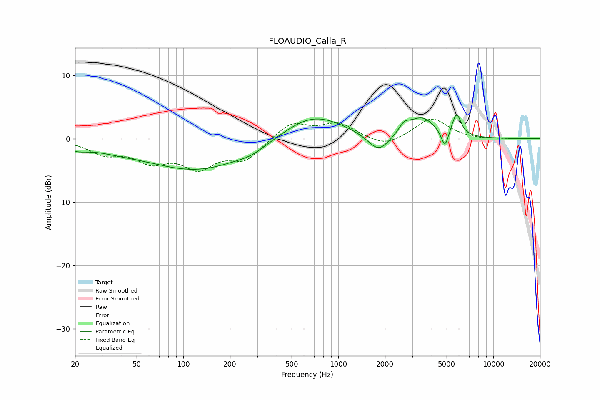

# FLOAUDIO_Calla_R
See [usage instructions](https://github.com/jaakkopasanen/AutoEq#usage) for more options and info.

### Parametric EQs
Apply preamp of -3.8 dB when using parametric equalizer.

|   # | Type    |   Fc (Hz) |    Q |   Gain (dB) |
|-----|---------|-----------|------|-------------|
|   1 | Peaking |        20 | 1.74 |        -1   |
|   2 | Peaking |        38 | 0.8  |        -0.8 |
|   3 | Peaking |       124 | 0.44 |        -4.8 |
|   4 | Peaking |       276 | 1.57 |        -0.8 |
|   5 | Peaking |       685 | 0.72 |         4   |
|   6 | Peaking |      1823 | 2.01 |        -3   |
|   7 | Peaking |      2667 | 3.79 |         1.4 |
|   8 | Peaking |      3469 | 1.69 |         3.1 |
|   9 | Peaking |      4874 | 6    |        -2.9 |
|  10 | Peaking |      5790 | 4.83 |         3.5 |

### Fixed Band EQs
When using fixed band (also called graphic) equalizer, apply preamp of **-3.2 dB** (if available) and set gains manually with these parameters.

|   # | Type    |   Fc (Hz) |    Q |   Gain (dB) |
|-----|---------|-----------|------|-------------|
|   1 | Peaking |        31 | 1.41 |        -2.1 |
|   2 | Peaking |        62 | 1.41 |        -3.1 |
|   3 | Peaking |       125 | 1.41 |        -4.1 |
|   4 | Peaking |       250 | 1.41 |        -3.1 |
|   5 | Peaking |       500 | 1.41 |         2.6 |
|   6 | Peaking |      1000 | 1.41 |         2.3 |
|   7 | Peaking |      2000 | 1.41 |        -1.4 |
|   8 | Peaking |      4000 | 1.41 |         3.3 |
|   9 | Peaking |      8000 | 1.41 |        -0.2 |
|  10 | Peaking |     16000 | 1.41 |         0   |

### Graphs

