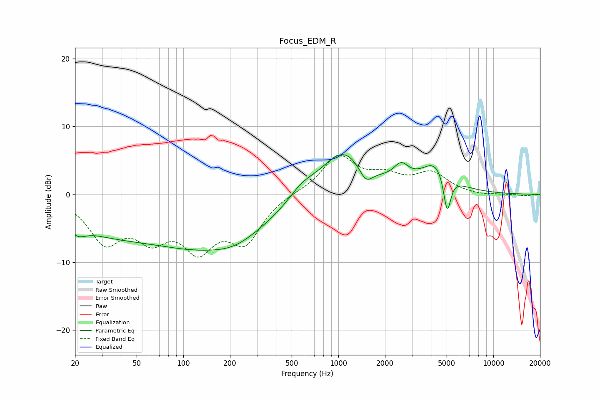

# Focus_EDM_R
See [usage instructions](https://github.com/jaakkopasanen/AutoEq#usage) for more options and info.

### Parametric EQs
Apply preamp of -5.9 dB when using parametric equalizer.

|   # | Type    |   Fc (Hz) |    Q |   Gain (dB) |
|-----|---------|-----------|------|-------------|
|   1 | Peaking |        21 | 2.68 |        -1.7 |
|   2 | Peaking |        30 | 0.53 |        -3.6 |
|   3 | Peaking |       141 | 0.34 |        -7.3 |
|   4 | Peaking |       216 | 1.06 |        -1.1 |
|   5 | Peaking |       579 | 1.62 |         1.8 |
|   6 | Peaking |      1073 | 0.93 |         6.9 |
|   7 | Peaking |      1504 | 3.11 |        -2.5 |
|   8 | Peaking |      2543 | 2.94 |         2.3 |
|   9 | Peaking |      4284 | 1.47 |         4.3 |
|  10 | Peaking |      5036 | 5.8  |        -5.9 |

### Fixed Band EQs
When using fixed band (also called graphic) equalizer, apply preamp of **-5.9 dB** (if available) and set gains manually with these parameters.

|   # | Type    |   Fc (Hz) |    Q |   Gain (dB) |
|-----|---------|-----------|------|-------------|
|   1 | Peaking |        31 | 1.41 |        -6.5 |
|   2 | Peaking |        62 | 1.41 |        -5.1 |
|   3 | Peaking |       125 | 1.41 |        -6.9 |
|   4 | Peaking |       250 | 1.41 |        -6.3 |
|   5 | Peaking |       500 | 1.41 |         0.3 |
|   6 | Peaking |      1000 | 1.41 |         5.5 |
|   7 | Peaking |      2000 | 1.41 |         2.2 |
|   8 | Peaking |      4000 | 1.41 |         2.9 |
|   9 | Peaking |      8000 | 1.41 |        -0.2 |
|  10 | Peaking |     16000 | 1.41 |        -0.2 |

### Graphs

