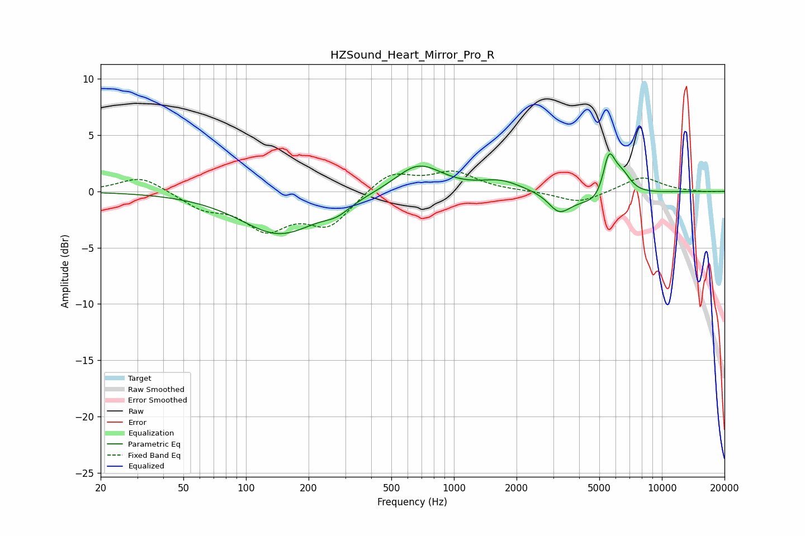

# HZSound_Heart_Mirror_Pro_R
See [usage instructions](https://github.com/jaakkopasanen/AutoEq#usage) for more options and info.

### Parametric EQs
Apply preamp of -3.4 dB when using parametric equalizer.

|   # | Type    |   Fc (Hz) |    Q |   Gain (dB) |
|-----|---------|-----------|------|-------------|
|   1 | Peaking |       145 | 0.75 |        -3.8 |
|   2 | Peaking |       274 | 2.28 |        -0.8 |
|   3 | Peaking |       675 | 1.26 |         2.5 |
|   4 | Peaking |      1680 | 1.44 |         0.9 |
|   5 | Peaking |      3168 | 2.91 |        -1.4 |
|   6 | Peaking |      3491 | 2.5  |        -0.4 |
|   7 | Peaking |      5291 | 1.53 |        -2.1 |
|   8 | Peaking |      5503 | 6    |         1.1 |
|   9 | Peaking |      5610 | 3.81 |         3.4 |
|  10 | Peaking |      6441 | 2.94 |         1.9 |

### Fixed Band EQs
When using fixed band (also called graphic) equalizer, apply preamp of **-1.9 dB** (if available) and set gains manually with these parameters.

|   # | Type    |   Fc (Hz) |    Q |   Gain (dB) |
|-----|---------|-----------|------|-------------|
|   1 | Peaking |        31 | 1.41 |         1.4 |
|   2 | Peaking |        62 | 1.41 |        -1.3 |
|   3 | Peaking |       125 | 1.41 |        -3.1 |
|   4 | Peaking |       250 | 1.41 |        -2.9 |
|   5 | Peaking |       500 | 1.41 |         1.8 |
|   6 | Peaking |      1000 | 1.41 |         1.6 |
|   7 | Peaking |      2000 | 1.41 |         0   |
|   8 | Peaking |      4000 | 1.41 |        -1.1 |
|   9 | Peaking |      8000 | 1.41 |         1.3 |
|  10 | Peaking |     16000 | 1.41 |        -0.1 |

### Graphs

