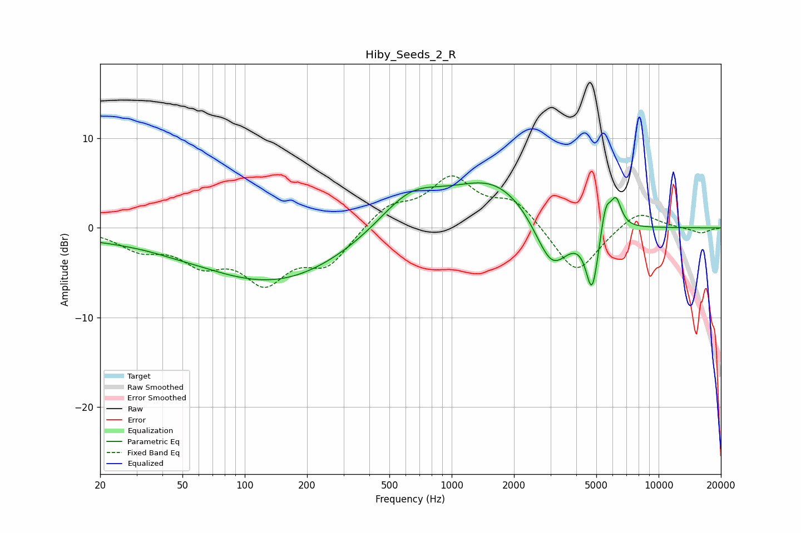

# Hiby_Seeds_2_R
See [usage instructions](https://github.com/jaakkopasanen/AutoEq#usage) for more options and info.

### Parametric EQs
Apply preamp of -5.1 dB when using parametric equalizer.

|   # | Type    |   Fc (Hz) |    Q |   Gain (dB) |
|-----|---------|-----------|------|-------------|
|   1 | Peaking |        35 | 0.18 |        -1   |
|   2 | Peaking |        46 | 1.76 |        -0.1 |
|   3 | Peaking |       145 | 0.4  |        -5.4 |
|   4 | Peaking |       628 | 0.93 |         4   |
|   5 | Peaking |      1635 | 0.67 |         5.3 |
|   6 | Peaking |      3048 | 1.63 |        -6.3 |
|   7 | Peaking |      4658 | 2.91 |         1.1 |
|   8 | Peaking |      4767 | 4.25 |        -8.1 |
|   9 | Peaking |      5545 | 5.63 |         3.4 |
|  10 | Peaking |      6223 | 5.12 |         3.2 |

### Fixed Band EQs
When using fixed band (also called graphic) equalizer, apply preamp of **-5.9 dB** (if available) and set gains manually with these parameters.

|   # | Type    |   Fc (Hz) |    Q |   Gain (dB) |
|-----|---------|-----------|------|-------------|
|   1 | Peaking |        31 | 1.41 |        -2.1 |
|   2 | Peaking |        62 | 1.41 |        -3.3 |
|   3 | Peaking |       125 | 1.41 |        -5.4 |
|   4 | Peaking |       250 | 1.41 |        -3.8 |
|   5 | Peaking |       500 | 1.41 |         2.4 |
|   6 | Peaking |      1000 | 1.41 |         5.2 |
|   7 | Peaking |      2000 | 1.41 |         2.9 |
|   8 | Peaking |      4000 | 1.41 |        -5.4 |
|   9 | Peaking |      8000 | 1.41 |         2.1 |
|  10 | Peaking |     16000 | 1.41 |        -0.6 |

### Graphs

