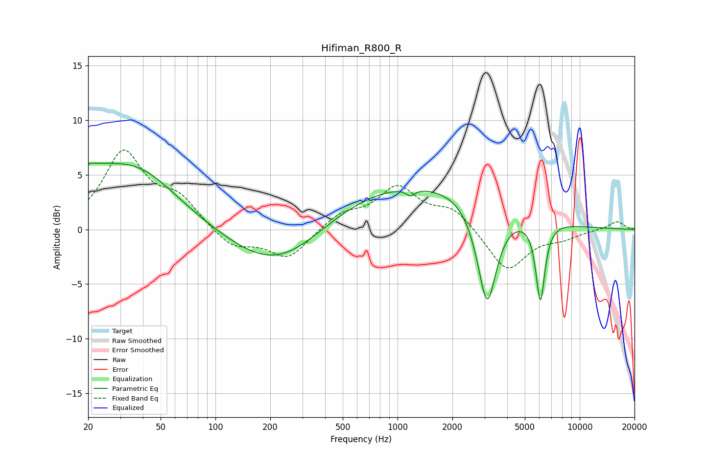

# Hifiman_R800_R
See [usage instructions](https://github.com/jaakkopasanen/AutoEq#usage) for more options and info.

### Parametric EQs
Apply preamp of -6.2 dB when using parametric equalizer.

|   # | Type    |   Fc (Hz) |    Q |   Gain (dB) |
|-----|---------|-----------|------|-------------|
|   1 | Peaking |        20 | 5.45 |         3.3 |
|   2 | Peaking |        21 | 5.88 |        -2.4 |
|   3 | Peaking |        22 | 1.39 |         1.7 |
|   4 | Peaking |        36 | 0.61 |         5.5 |
|   5 | Peaking |       225 | 0.55 |        -4.3 |
|   6 | Peaking |      1148 | 0.27 |         4.5 |
|   7 | Peaking |      1180 | 5.93 |        -0.6 |
|   8 | Peaking |      2146 | 2.13 |         0.1 |
|   9 | Peaking |      3101 | 2.62 |        -9.4 |
|  10 | Peaking |      6085 | 5.55 |        -7.3 |

### Fixed Band EQs
When using fixed band (also called graphic) equalizer, apply preamp of **-7.4 dB** (if available) and set gains manually with these parameters.

|   # | Type    |   Fc (Hz) |    Q |   Gain (dB) |
|-----|---------|-----------|------|-------------|
|   1 | Peaking |        31 | 1.41 |         6.9 |
|   2 | Peaking |        62 | 1.41 |         2.5 |
|   3 | Peaking |       125 | 1.41 |        -1.7 |
|   4 | Peaking |       250 | 1.41 |        -2.7 |
|   5 | Peaking |       500 | 1.41 |         1.4 |
|   6 | Peaking |      1000 | 1.41 |         3.7 |
|   7 | Peaking |      2000 | 1.41 |         1.8 |
|   8 | Peaking |      4000 | 1.41 |        -3.9 |
|   9 | Peaking |      8000 | 1.41 |        -0.7 |
|  10 | Peaking |     16000 | 1.41 |         0.8 |

### Graphs

